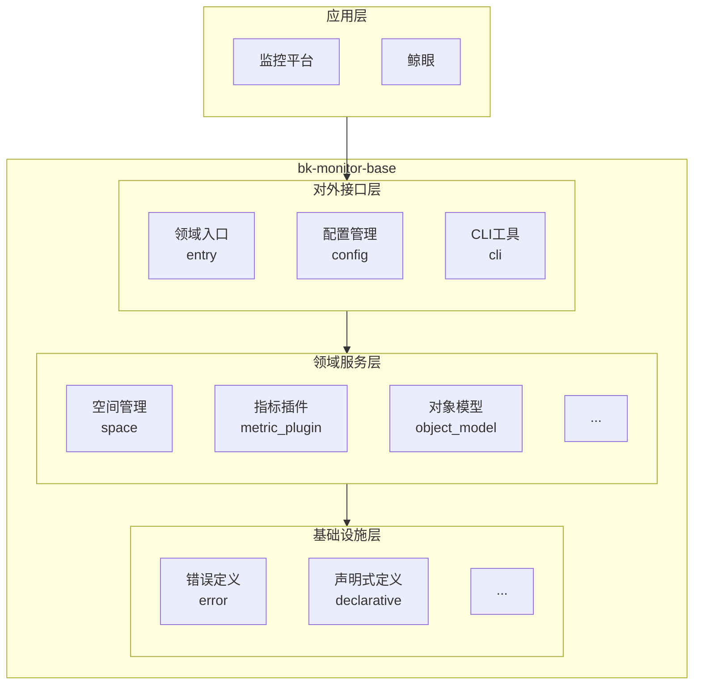

# 架构概览

## 项目简介

蓝鲸智云监控平台(BLUEKING-MONITOR)是蓝鲸智云官方推出的一款监控平台产品，除了具有丰富的数据采集能力，大规模的数据处理能力，简单易用，还提供更多的平台扩展能力。依托于蓝鲸 PaaS，有别于传统的 CS 结构，在整个蓝鲸生态中可以形成监控的闭环能力。

此项目是监控平台的子项目，主要是提供监控平台的基础能力，如空间管理、数据采集、元数据管理等。上层SaaS可以基于此项目提供的能力，实现多样的场景化能力。

## 技术架构

### 架构组件

## 模块架构

### 1. 领域服务 (domains)
核心业务逻辑模块，包含空间管理、数据采集、元数据管理、指标插件等业务功能。

### 2. 配置管理 (config)
统一的配置管理模块，支持 .env、环境变量等多种配置方式，并且提供 Django 配置模块，方便使用方对接。

### 3. CLI工具 (cli)
命令行工具模块，提供 Django 数据迁移、交互式 Shell、管理命令等开发和维护工具。

### 4. 基础设施 (infras)
底层支撑模块，提供声明式资源管理、错误定义、工具库等基础能力。

## 架构特点

1. **分层架构**：清晰的领域驱动设计，各层职责明确
2. **模块化设计**：每个功能模块独立，便于维护和扩展
3. **配置集中化**：统一的配置管理，支持多环境部署
4. **CLI工具化**：提供丰富的命令行工具，便于开发和维护
5. **基础设施**：统一的错误定义、声明式定义、工具库等基础能力

