## 附录：详细架构图与数据流图

### A. 整体前端架构图

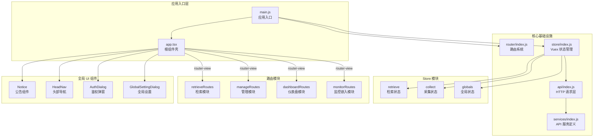

---

### B. 应用启动时序图

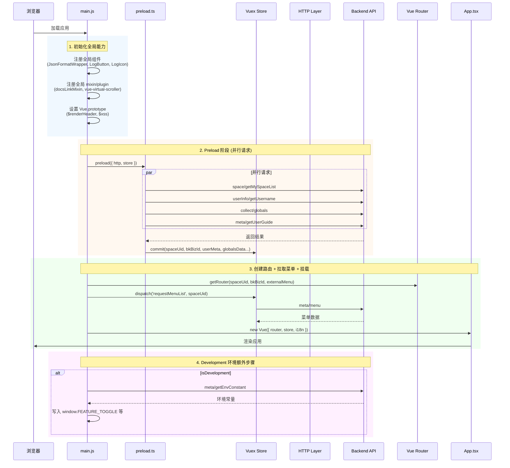

---

### C. 路由守卫执行流程

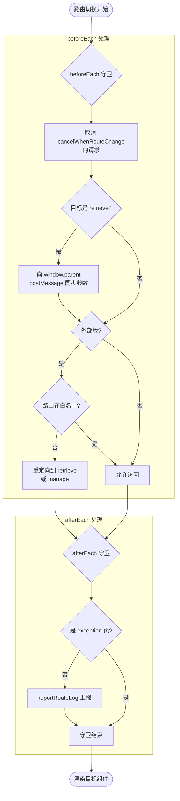

---

### D. Retrieve 检索模块初始化数据流

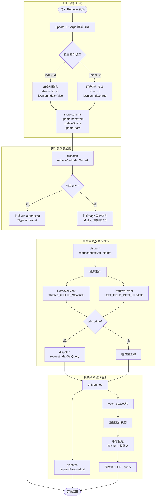

---

### E. HTTP 请求处理流程

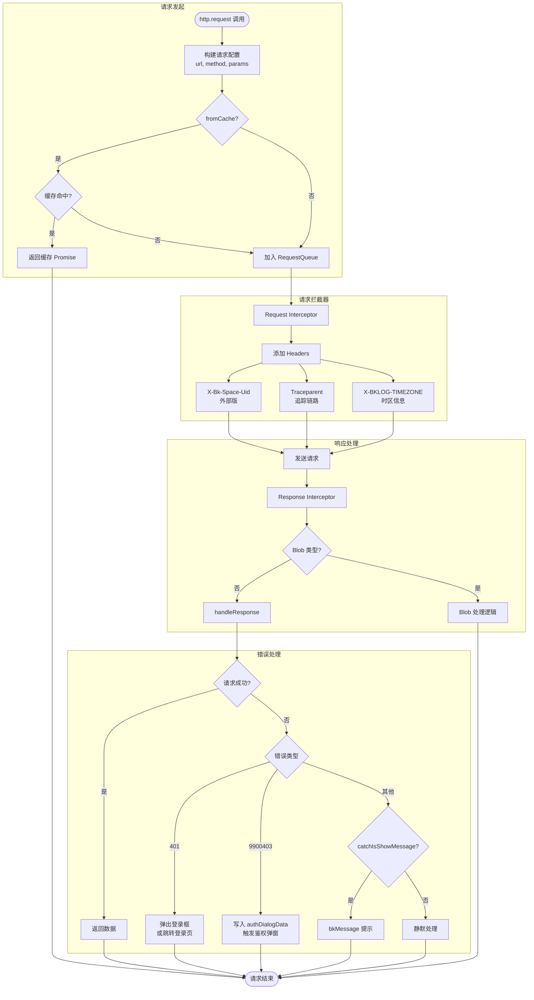

---

### F. Vuex Store 状态流转图

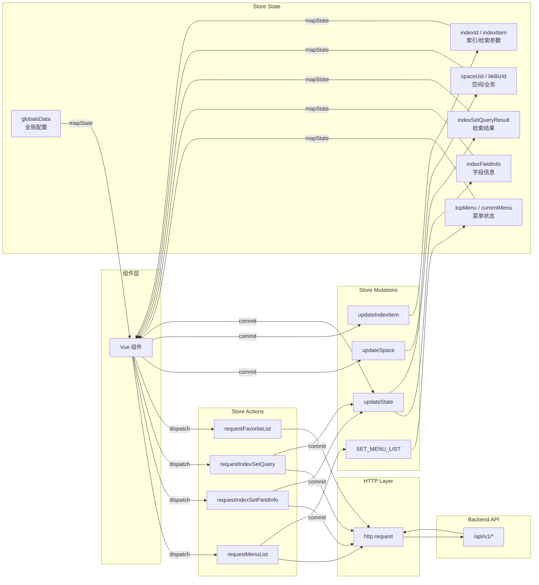

---

### G. 检索模块 API 调用链路图

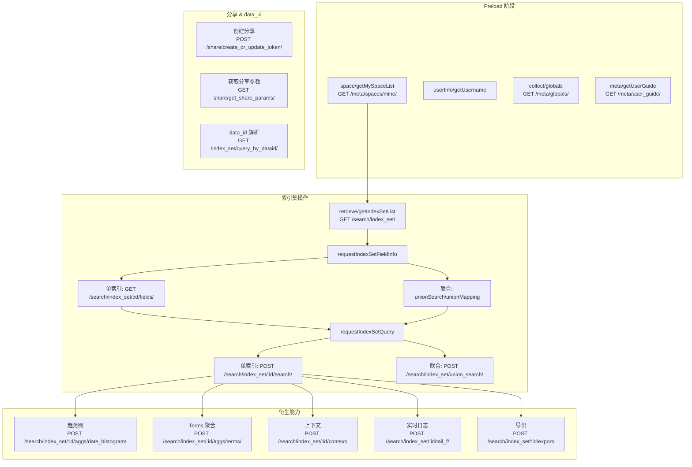

---

### H. Manage 管理模块组件结构图

```mermaid
graph TB
    subgraph "管理模块壳"
        MANAGE_INDEX["@/views/manage/index.vue<br/>左侧导航 + 子导航 + 右侧内容"]
    end

    subgraph "日志接入/采集"
        C1["collection-item/list<br/>采集项列表"]
        C2["collection-item/manage/:id<br/>采集项详情"]
        C3["collection-item/{add|edit|field|storage|masking}/:id<br/>接入步骤"]
        C4["log-index-set/list<br/>索引集列表"]
        C5["log-index-set/{manage|edit|masking}/:id<br/>索引集详情"]
    end

    subgraph "客户端日志"
        T1["tgpa-task/list<br/>客户端日志列表"]
        T2["tgpa-task/clean-config<br/>清洗配置"]
    end

    subgraph "其他数据源"
        O1["bk-data-collection<br/>计算平台"]
        O2["es-collection<br/>第三方 ES"]
        O3["custom-report<br/>自定义上报"]
    end

    subgraph "日志清洗"
        CL1["clean-list/list<br/>清洗列表"]
        CL2["clean-templates/list<br/>清洗模板"]
        CL3["log-desensitize/list<br/>脱敏列表"]
    end

    subgraph "日志归档"
        A1["archive-repository<br/>归档仓库"]
        A2["archive-list<br/>归档列表"]
        A3["archive-restore<br/>归档还原"]
    end

    subgraph "日志提取"
        E1["manage-log-extract<br/>提取配置"]
        E2["log-extract-task<br/>提取任务"]
        E3["extract-link-manage<br/>链路管理"]
    end

    subgraph "系统设置"
        S1["es-cluster-manage<br/>ES集群管理"]
        S2["report-manage<br/>订阅管理"]
        S3["collection-track<br/>全链路追踪"]
        S4["manage-data-link-conf<br/>数据链路配置"]
    end

    MANAGE_INDEX --> C1
    MANAGE_INDEX --> C2
    MANAGE_INDEX --> C3
    MANAGE_INDEX --> C4
    MANAGE_INDEX --> C5
    MANAGE_INDEX --> T1
    MANAGE_INDEX --> T2
    MANAGE_INDEX --> O1
    MANAGE_INDEX --> O2
    MANAGE_INDEX --> O3
    MANAGE_INDEX --> CL1
    MANAGE_INDEX --> CL2
    MANAGE_INDEX --> CL3
    MANAGE_INDEX --> A1
    MANAGE_INDEX --> A2
    MANAGE_INDEX --> A3
    MANAGE_INDEX --> E1
    MANAGE_INDEX --> E2
    MANAGE_INDEX --> E3
    MANAGE_INDEX --> S1
    MANAGE_INDEX --> S2
    MANAGE_INDEX --> S3
    MANAGE_INDEX --> S4
```

---

### I. 完整页面请求时序图（以检索页为例）

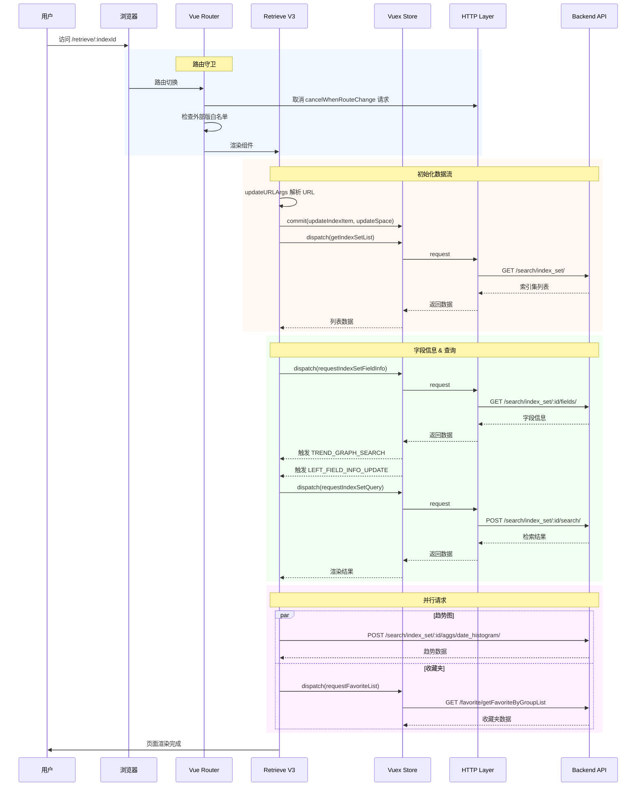

---

### J. API Key 映射查找流程

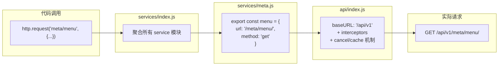

---

### K. 分层架构全景图

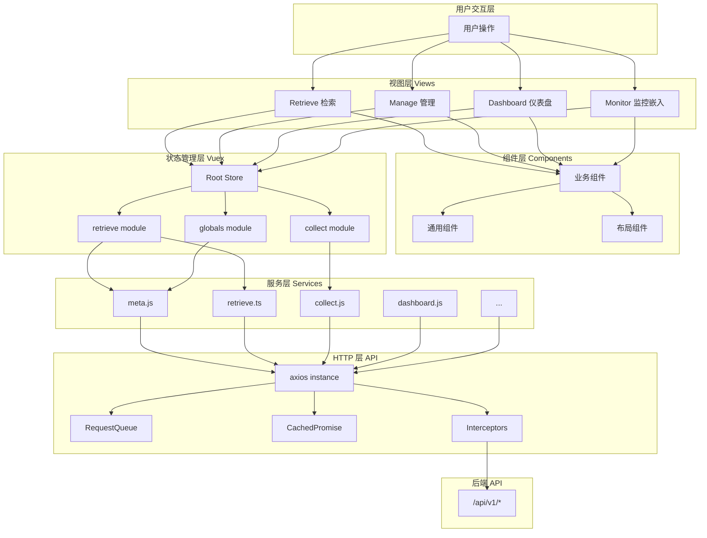

---

### L. 空间切换数据流

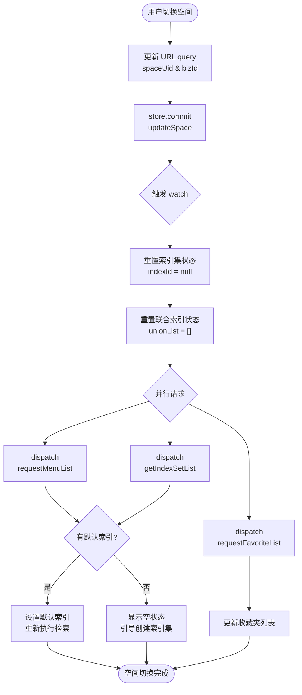