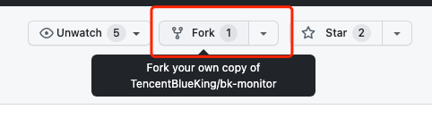

# 日志前端构建使用说明

#### 安装和更新前端依赖（`nodejs`最小依赖版本为`"node": ">= 18"`）

```bash
cd webpack
npm ci
#### mac
npm run install-build
```

如果您尚未安装过 `nodejs` [详细安装参见](https://nodejs.org/zh-cn/download/)

# 本地开发模式

## 前置准备

1、项目仓库: https://github.com/TencentBlueKing/bk-monitor 请确保拥有该仓库的 Write 及以上的权限

点击页面右上角的 Fork ，创建个人的 Fork 仓库



2、Clone：克隆仓库到本地
```
git clone https://github.com/{username}/bk-monitor.git
```

3、添加上游远端
```
git remote add upstream https://github.com/TencentBlueKing/bk-monitor.git
```
4、 设置提交者信息。切勿使用内部用户名及邮箱
```
git config user.name "your_github_username"
git config user.email "your_github_email"
```

5、配置GPG Key用于commit签名
[关于提交签名验证](https://docs.github.com/zh/authentication/managing-commit-signature-verification/about-commit-signature-verification)

### 安装gpg
注意：在生成新 GPG 密钥之前，请确保已验证你的电子邮件地址。 如果尚未验证电子邮件地址，将无法使用 GPG 对提交和标记进行签名。有关详细信息，请参阅“验证电子邮件地址”。

下载并安装适用于操作系统的 [GPG](https://www.gnupg.org/download/index.html) 命令行工具。 一般来说，我们建议安装适用于您的操作系统的最新版本。

打开Git Bash。

### 生成GPG Key并导出公钥
```
gpg --full-generate-key
```

#### 创建过程中它会要你输入各种参数。

- 秘钥类型: RSA

- 秘钥长度: 4096

- 有效期: 3y (自己看想要多长)

- 姓名和邮箱：确保和github config配置的user.name和user.email保持一致（邮箱可以使用Github的隐私邮箱）

- 密码：以后每次加密操作都会让你输入密码，可以为空

#### 创建完成后通过以下命令查看创建好的GPG Key，记下sec那一行/后的GPG key ID，在这里是3AA5C34371567BD2，后续使用的GPG_Key_ID都是从这里来的。

```
$ gpg --list-secret-keys --keyid-format=long
/Users/hubot/.gnupg/secring.gpg
------------------------------------
sec   4096R/3AA5C34371567BD2 2016-03-10 [expires: 2017-03-10]
uid                          Hubot <hubot@example.com>
ssb   4096R/4BB6D45482678BE3 2016-03-10
```

#### 然后通过以下命令导出公钥，也可以添加--output将公钥导出到指定的文件里
- GPG_Key_ID 可以来自上一步查看 sec 也可以使用注册的 email

```
# 导出公钥
$ gpg --armor --export GPG_Key_ID | email

-----BEGIN PGP PUBLIC KEY BLOCK-----
xxxxxxxxxxxxxxxxxxxxxxxxxxxxxxxxxxxx
-----END PGP PUBLIC KEY BLOCK-----

#### 将公钥导出为文件
$ gpg --output ~/.ssh/public.gpg --armor --export GPG_Key_ID | email
```

### 在Github上配置GPG Key公钥
#### 通过 https://github.com/settings/keys Github -> Settings -> SSH and GPG keys -> New GPG key 在页面上配置你的公钥。

#### 也可以使用GitHub CLI直接导入GPG Key，只需要使用上一步到处的公钥文件即可。
```
gh gpg-key add ~/.ssh/public.gpg
```

### 在Git上配置GPG Key
```
# 然后在本地项目配置 GPG Key 即可。
git config user.signingkey GPG_Key_ID

# 开启自动commit签名
git config commit.gpgsign true

# 开启自动tag签名
git config tag.gpgsign true
```

## 本地启动

  ```bash
  # pc端本地开发模式
  npm run dev
  ```

### 本地 `hosts` 文件配置
```javascript
// 因为devServer启动设置了 `const host = `appdev.${devProxyUrl.match(/\.([^.]+)\.com\/?/)[1]}.com`;`
// 需要将 appdev.${devProxyUrl.match(/\.([^.]+)\.com\/?/)[1]}.com 配置到 hosts 文件，避免启动失败
// 例如：const devProxyUrl = `https://xxx.domain.com`
// hosts 配置为 127.0.0.1 appdev.domain.com
```

### 前端环境变量配置

  1. 新建文件 `local.settings.js`

  2. 配置自定义内容 参考如下 [更多配置参见](https://webpack.docschina.org/configuration/dev-server/)

     ```js
     const devProxyUrl = ''
     const devHost = ''
     const loginHost = ''
     const devPort =
     module.exports = {
         port: devPort, // 启动端口
         host: devHost, // 启动host
         devProxyUrl, // 后端地址 用于代理转发api
         loginHost, // 登入地址
         proxy: { // api代理配置
             '/rest': {
                 target: devProxyUrl,
                 changeOrigin: true,
                 secure: false,
                 toProxy: true
             }
     }

     ```

## 生产构建

### 构建

  ```bash
  npm run build
  ```

### 分析构建产物组成

  ```bash
  # 生产环境构建产物分析
  npm run analyze
  ```

## 格式化以及校验

### 格式化
  1、biome格式化配置[文档](https://biomejs.dev/zh-cn/reference/configuration/)
  2、biome格式化命令
  ```bash
  # 格式化
  npm run biome:format
  ```
  3、biome vscode扩展[文档](https://biomejs.dev/zh-cn/reference/vscode/)
  > 注意：目前安装这个插件可能启动会失败，可以手动格式化；有git钩子，也可不手动格式化

### 校验
  1、oxlint校验配置[文档](https://oxc.rs/docs/guide/usage/linter/rules.html)
  2、oxlint校验命令
  ```bash
  # 校验
  npm run oxlint
  ```
  3、oxlint vscode扩展[文档](https://oxc.rs/docs/guide/usage/linter.html#vscode-extension)