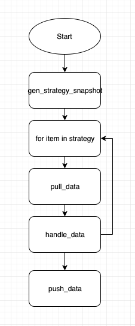

# Detect

该模块负责对接各种检测算法，对标准数据进行判断，输出标准的事件数据。

## 模块设计

Detect Process 流程：



## 数据处理流程

### 1. 生成策略快照 gen_strategy_snapshot

- 根据策略id，获取策略配置信息，生成策略快照对应的 key：strategy_snapshot_key
- 保存策略快照到 `STRATEGY_SNAPSHOT_KEY`
- 后续进程需要策略快照信息可以调用：

  > Strategy.get_strategy_snapshot_by_key(strategy_snapshot_key)

### 2. 拉取数据 pull_data

基于 item，拉取 access 模块存入的数据，并转化成 DataPoint 待检测。

- 数据来源：redis
    - key: DATA_LIST_KEY
    - 格式（DATA_LIST_KEY 中的一条数据格式示例）：

      ```json
      {
          "record_id": "{dimensions_md5}.{timestamp}",
          "value": 1.38,
          "values": {
              "timestamp": 1569246480,
              "load5": 1.38
          },
          "dimensions": {
              "ip": "127.0.0.1"
          },
          "time": 1569246480
      }
      ```

    - 数据输出：inputs[item.id]

### 3. 处理数据 handle_data

> 基于 item，将待检测的 DataPoints，按照 item 中的检测算法分级进行检测。

- 数据输入： inputs[item.id]
- 处理流程：
    1. 基于 item 下的告警级别：使用检测算法配置，加载检测器 detector
    2. detector 将 data_points 检测完成后，生成 anomaly_records
    3. 更新时序数据检测结果到 `CHECK_RESULT_CACHE_KEY`
    4. 更新每个维度最后的检测时间到 `LAST_CHECKPOINTS_CACHE_KEY`
    5. 根据 anomaly_records 生成异常信息至 outputs[item.id]
- 数据输出：outputs[item.id]

### 4. 推送数据 push_data

按 item 推送 outputs 中的异常信息，供 trigger 模块消费。

- 数据输入：outputs
- 推送流程：
    1. 遍历 outputs 内的 `item.id`
    2. 将 outputs[item.id] 的数据序列化，并推送至 `ANOMALY_LIST_KEY`
    3. 发送异常信号至 `ANOMALY_SIGNAL_KEY`

#### 异常信息格式（ANOMALY_LIST_KEY 内的一条数据格式示例）：

```json
{
  "data": {
    "record_id": "{dimensions_md5}.{timestamp}",
    "value": 1.38,
    "values": {
      "timestamp": 1569246480,
      "load5": 1.38
    },
    "dimensions": {
      "ip": "10.0.0.1"
    },
    "time": 1569246480
  },
  "anomaly": {
    "1": {
      "anomaly_message": "空闲率 >= 51.0% 同时  <= 100.0%, 当前值99%",
      "anomaly_id": "{dimensions_md5}.{timestamp}.{strategy_id}.{item_id}.{level}",
      "anomaly_time": "2019-10-10 10:10:00"
    }
  },
  "strategy_snapshot_key": "cache.strategy.snapshot.{strategy_id}.{update_time}"
}
```

#### 异常信号格式（ANOMALY_SIGNAL_KEY 内的一条数据格式示例）：

```python
# "{strategy_id}.{item_id}"
"11.37"
```

## 模型定义

### 数据相关

- DataPoint
    - 在 pull_data 中被初始化。
- AnomalyDataPoint
    - 被 detector 处理后的 DataPoint，如果是异常，则会变成 AnomalyDataPoint。

### 检测算法

- Algorithms
- ExprDetectAlgorithms
- BasicAlgorithmsCollection

## Redis 数据结构

- **STRATEGY_SNAPSHOT_KEY**
    - 说明：异常检测使用的策略快照
    - 生产模块：`detect` `nodata`
    - 类型：`List`
    - key：`"cache.strategy.snapshot.{strategy_id}.{update_time}"`

- **DATA_LIST_KEY**
    - 说明：待检测数据队列， 基于 strategy item 拉取到的数据将会推送至该队列中
    - 生产模块：`access`
    - 类型：`List`
    - key：`"{prefix}.access.data.{{strategy_id}}.{{item_id}}"`

- **CHECK_RESULT_CACHE_KEY**
    - 说明：按时序存放 detector 对数据进行检测结果
    - 生产模块：`detect`
    - 类型：SortedSet
    - key："`{prefix}.detect.result.{{strategy_id}}.{{item_id}}.{{dimensions_md5}}.{{level}}`"
    - score：数据的时间戳
    - member：
        - 非异常的数据：`"{}|{}".format(timestamp, value))`
        - 异常的数据：`"{}|{}".format(timestamp, ANOMALY_LABEL)`

- **LAST_CHECKPOINTS_CACHE_KEY**
    - 说明：缓存 item 下的每个 time_series（维度/level） 的最后检测时间戳，以及 item
      的最后检测时间戳（dimensions_md5=LATEST_POINT_WITH_ALL_KEY）
    - 生产模块：`detect` `nodata`
    - 类型：`Hash`
    - key：`"detect.last.checkpoint.{strategy_id}.{item_id}"`
    - field：`"detect.result.{dimensions_md5}.{level}"`
    - value：time series 最后检测点时间戳

- **ANOMALY_LIST_KEY**
    - 说明：检测结果详情队列
    - 生产模块：`detect`
    - 类型：`List`
    - key：`"{prefix}.detect.anomaly.list.{strategy_id}.{item_id}"`

- **ANOMALY_SIGNAL_KEY**
    - 说明：异常信号队列
    - 生产模块：`detect``
    - 类型：`List`
    - key：`"{prefix}.detect.anomaly.signal"`

## 策略模块：

### 时序数据检测算法

#### 静态阈值

- 实现原理：

```
{value} {comp} {threshold}

# value：当前值
# method：比较运算符(=，>， >=， <， <=, !=)
# threshold： 阈值
# 当前值 (value) 和阈值 (threshold) 进行比较运算

多条件时，使用and或or关联。 判断规则：or 之前为一组
例：
>= 10 and <= 100 or = 0 or >= 120 and <= 200
(>= 10 and <= 100) or (= 0)  or (>= 120 and <= 200)
```

- 示例：当 value(91)，threshold(90)，method(>)时，则判断为异常
- 场景：适用于许多场景，如磁盘使用率检测，机器负载等

#### 同比策略（简易）

- 实现原理：

```
{value} >= {history_value} * (100 + ceil) * 0.01)
or
{value} <= {history_value} * (100 - floor) * 0.01)

# value：当前值
# history_value：上周同一时刻值
# ceil：升幅
# floor：降幅
# 当前值(value) 与上周同一时刻值 (history_value)进行升幅/降幅计算

```

- 示例：当 value(90)，ceil(100)，history_value(40)时，则判断为异常
- 场景：适用于以周为周期的曲线场景。比如pv、在线人数等

#### 环比策略（简易）

- 实现原理：

```
# 算法原理和同比策略（简易）一致，只是用来做比较的历史值含义不一样。
{value} >= {history_value} * (100 + ceil) * 0.01)
or
{value} <= {history_value} * (100 - floor) * 0.01)

# value：当前值
# history_value：前一时刻值
# ceil：升幅
# floor：降幅
# 当前值(value) 与前一时刻值 (history_value)进行升幅/降幅计算

```

- 示例：当 value(90)，ceil(100)，history_value(40)时，则判断为异常
- 场景：适用于需要检测数据陡增或陡降的场景。如交易成功率、接口访问成功率等

#### 同比策略（高级）

- 实现原理：

```
# 算法原理和同比策略（简易）一致，只是用来做比较的历史值含义不一样。
{value} >= {history_value} * (100 + ceil) * 0.01)
or
{value} <= {history_value} * (100 - floor) * 0.01)

# value：当前值
# history_value：前n天同一时刻绝对值的均值
# ceil：升幅
# floor：降幅
# 当前值(value) 与前n天同一时刻绝对值的均值 (history_value)进行升幅/降幅计算

# 前n天同一时刻绝对值的均值计算示例
以日期2019-08-26 12:00:00为例，如果n为7，历史时刻和对应值如下：
```

|   | 时间                 | 值   |
|---|--------------------|-----|
| 1 | 2019-8-25 12:00:00 | 12  |
| 2 | 2019-8-24 12:00:00 | -22 |
| 3 | 2019-8-23 12:00:00 | 32  |
| 4 | 2019-8-22 12:00:00 | 42  |
| 5 | 2019-8-21 12:00:00 | 52  |
| 6 | 2019-8-20 12:00:00 | 62  |
| 7 | 2019-8-19 12:00:00 | 72  |

```
取绝对值，因此所有的值为正数
history_value = (12 + 22 + 32 + 42 + 52 + 62 +72) / 7 = 42
```

- 示例：当 value(90)，ceil(100)，history_value(42)时，则判断为异常
- 场景：适用于需要检测数据陡增或陡降的场景。如交易成功率、接口访问成功率等

#### 环比策略（高级）

- 实现原理：

```
# 算法原理和同比策略（简易）一致，只是用来做比较的历史值含义不一样。
{value} >= {history_value} * (100 + ceil) * 0.01)
or
{value} <= {history_value} * (100 - floor) * 0.01)

# value：当前值
# history_value：前n个时间点的均值
# ceil：升幅
# floor：降幅
# 当前值(value) 与前个时间点的均值 (history_value)进行升幅/降幅计算

# 前n个时间点的均值计算示例（数据周期1分钟）
以日期2019-08-26 12:00:00为例，如果n为5，历史时刻和对应值如下：
```

|   | 时间                 | 值  |
|---|--------------------|----|
| 1 | 2019-8-26 11:59:00 | 12 |
| 2 | 2019-8-26 11:58:00 | 22 |
| 3 | 2019-8-26 11:57:00 | 32 |
| 4 | 2019-8-26 11:56:00 | 42 |
| 5 | 2019-8-26 11:55:00 | 52 |

```
history_value = (12 + 22 + 32 + 42 + 52) / 5 = 32
```

- 示例：当 value(90)，ceil(100)，history_value(32)时，则判断为异常
- 场景：适用于需要检测数据陡增或陡降的场景。如交易成功率、接口访问成功率等(与环比策略（简易）使用场景类似)

#### 同比振幅

- 实现原理&示例：

```
# 算法示例：
当前值 − 前一时刻值 >= 过去 5 天内任意一天同时刻差值 × 2 + 3
 
以日期2019-08-26 12:00:00为例，如果n为5，历史时刻和对应值如下：
```

|   | 时间                 | 值  | 前一时刻               | 前一时刻值 | 差值 |
|---|--------------------|----|--------------------|-------|----|
| 0 | 2019-8-26 12:00:00 | 26 | 2019-8-26 11:59:00 | 10    | 16 |
| 1 | 2019-8-25 12:00:00 | 25 | 2019-8-25 11:59:00 | 18    | 7  |
| 2 | 2019-8-24 12:00:00 | 24 | 2019-8-24 11:59:00 | 30    | 6  |
| 3 | 2019-8-23 12:00:00 | 23 | 2019-8-23 11:59:00 | 31    | 8  |
| 4 | 2019-8-22 12:00:00 | 22 | 2019-8-22 11:59:00 | 32    | 10 |
| 5 | 2019-8-21 12:00:00 | 21 | 2019-8-21 11:59:00 | 33    | 12 |

```
# 当前值
value = 26
# 前一时刻值
prev_value = 10
# 比较运算符(=，>， >=， <， <=, !=)
method = ">="
# 波动率
ratio = 2
# 振幅
shock = 3
# 当前值一前一时刻值的差值
current_diff = 16
# 5天内同时刻差值
prev5_diffs = [7, 6, 8, 10, 12]

前第二天(2019-8-24)同时刻差值： 6 * ratio(2) + shock(3) = 15
current_diff(16) >= 15

# 当前值(26) - 前一时刻值(10) >= 2天前的同一时刻差值6 * 2 + 3
此时算法检测判定为检测结果为异常:
```

- 场景：适用于监控以天为周期的事件，该事件会明确导致指标的升高或者下降，但需要监控`超过合理范围幅度变化`的场景。

  比如每天上午10点有一个抢购活动，活动内容不变，因此请求量每天10:00 相比 09:
  59会有一定的升幅。因为活动内容不变，所以请求量的升幅是在一定范围内的。使用该策略可以发现异常的请求量。

#### 同比区间

- 实现原理&示例：

```
# 算法示例：
当前值 >= 过去 5 天内同时刻绝对值 × 2 + 3
 
以日期2019-08-26 12:00:00为例，如果n为5，历史时刻和对应值如下：
```

|   | 时间                 | 值  |
|---|--------------------|----|
| 0 | 2019-8-26 12:00:00 | 26 |
| 1 | 2019-8-25 12:00:00 | 16 |
| 2 | 2019-8-24 12:00:00 | 14 |
| 3 | 2019-8-23 12:00:00 | 13 |
| 4 | 2019-8-22 12:00:00 | 16 |
| 5 | 2019-8-21 12:00:00 | 15 |

```
# 当前值
value = 11
# 比较运算符(=，>， >=， <， <=, !=)
method = ">="
# 波动率
ratio = 2
# 振幅
shock = 3

前第3天(2019-8-23)同时刻值： 13 * ratio(2) + shock(3) = 26
value(26) >= 26

# 当前值(26) >= 3天前的同一时刻绝对值13 * 2 + 3
此时算法检测判定为检测结果为异常:
```

- 场景：适用于以天为周期的曲线场景。

#### 环比振幅

- 实现原理&示例：

```
# 当前值(value) 与前一时刻值 (prev_value)均>= (threshold)，且之间差值>=前一时刻值 (prev_value) * (ratio) + (shock)

# value：当前值
# prev_value：前一时刻值
# threshold：阈值下限
# ratio：波动率
# shock：振幅

以日期2019-08-26 12:00:00为例：
```

|   | 时间                 | 值  |
|---|--------------------|----|
| 0 | 2019-8-26 12:00:00 | 46 |
| 1 | 2019-8-26 11:59:00 | 12 |

```
# 当前值
value = 46
# 前一时刻值
prev_value = 12
# 波动率
ratio = 2
# 振幅
shock = 3

value(46) >= 10  and prev_value(12) >=10
value(46) >= prev_value(12) * (ratio(2) + 1) + shock(3)

此时算法检测判定为检测结果为异常:
# 当前值(46)与前一时刻值(12)均>= (10)，且之间差值>=前一时刻值 (12) * (2) + (3)
```

- 场景：适用于指标陡增或陡降的场景，如果陡降场景，ratio配置的值需要 < -1
- 该算法将环比算法自由开放，可以通过配置 波动率 和 振幅，来达到对数据陡变的监控。同时最小阈值可以过滤无效的数据。

#### 策略场景总结

针对周期性的曲线，可以根据周期特点选择适当的同比算法：

| 周期 | 算法                 |
|----|--------------------|
| 周  | 同比策略（简易）           |
| 日  | 同比策略（高级），同比区间，同比振幅 |

针对实时突增突降需求，可以选择环比算法：

- 环比策略（简易）
- 环比策略（高级）
- 环比振幅

### 特殊检测算法（基于时序数据检测异常事件）

#### 系统重启

内置检测算法：基于时序数据 system.env.uptime 进行判断。

```
# 主机运行时长在0到600秒之间
# 主机当前运行时长比前一周期值小，或者前一个周期值为空
```

#### 进程端口

内置检测算法: 基于时序数据system.proc_port.exists 及nonlisten, not_accurate_listen 判断

```
# exists != 1 进程不存在
# nonlisten != [] 端口不存在
# not_accurate_listen != [] 进程存在，但端口和cmdb注册端口不一致
```

### 日志关键字检测算法

仅支持静态阈值

## 可监控的指标：

`# todo`

## 单元测试：

### run tests：

```shell
env DJANGO_SETTINGS_MODULE=settings BKAPP_DEPLOY_PLATFORM=enterprise pytest alarm_backends/tests/service/detect
```

## 性能测试数据：

`# todo`