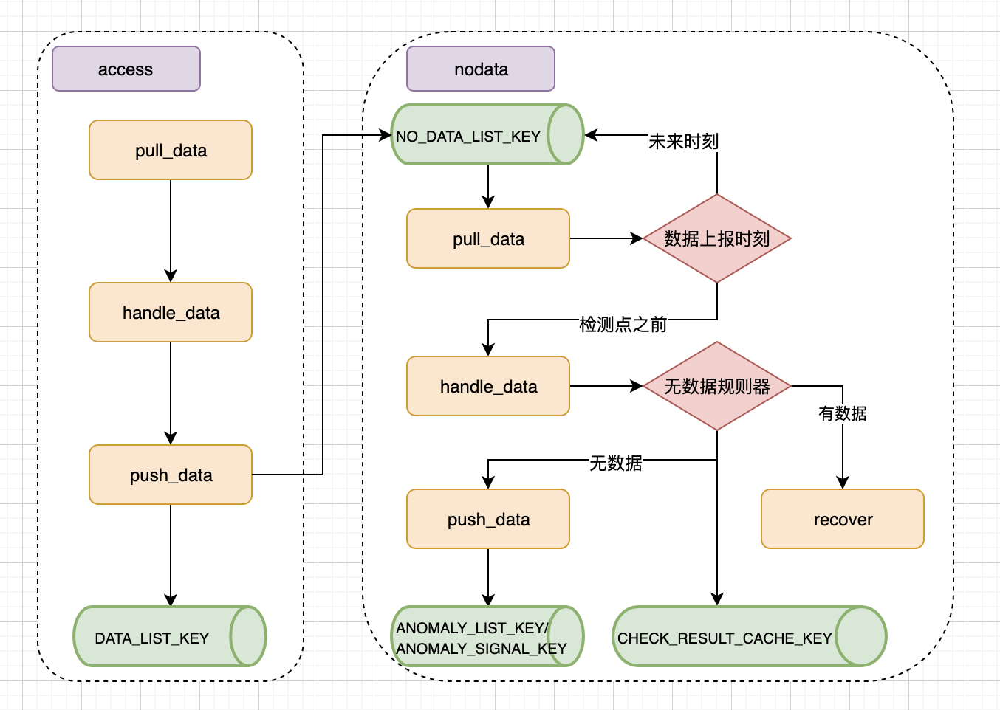

# Nodata

模块负责检测配置了无数据告警的策略监控项，是否有稳定的数据上报，如果满足连续周期检测不到新数据，则输出标准的事件数据


## 模块设计

Nodata check 流程



## 数据处理流程

### access push_data

- 推送原理
access 模块在推送检测数据时，如果判断到策略监控项 tem.no_data_config['is_enabled'] 开启，则将数据同时推送一份到 
key.NO_DATA_LIST_KEY 队列

- 数据格式
```json
{
    "record_id":"f7659f5811a0e187c71d119c7d625f23.1569246480",
    "value": 1.38,
    "values":{
        "timestamp": 1569246480,
        "load5": 1.38
    },
    "dimensions":{
        "bk_target_ip":"127.0.0.1",
        "bk_target_cloud_id": "0",
        "custom_dimension": "a"
    },
    "time": 1569246480
}
```
注意，dimensions 的 value 一般都是字符串。


### nodata pull_data

- 数据来源
redis: key.NO_DATA_LIST_KEY

- 变量定义
now_timestamp: 任务执行时刻 now_timestamp = arrow.utcnow().timestamp
check_timestamp: 无数据监测时刻 check_timestamp = (now_timestamp / agg_interval) * agg_interval - agg_interval
record: 上报数据，json 个数

- 数据筛选
1）尝试拉取 check_timestamp 之前的所有上报数据
2）如果第一步未拉取到任何数据，尝试拉取 check_timestamp 之后数据中首个周期时刻数据
3）将剩余数据推回 key.NO_DATA_LIST_KEY 队列

- 数据输出
inputs[item.id]: [DataPoint(json.loads(record), item)]


### nodata handle_data -> item.check

- 数据来源
inputs[item.id]

- 变量定义
no_data_dimensions: 无数据告警维度，如 ["bk_target_ip", "bk_target_cloud_id"]
data_dimensions: 上报数据按无数据告警维度降维后的数据
data_dimensions_mds: data_dimensions 对应的 md5 缓存
dimensions_md5_timestamp: data_dimensions md5 到最新上报时刻的映射
target_instance_dimensions: 无数据待检测维度
target_dimensions_md5: target_instance_dimensions 对应的 md5 缓存
missing_target_instances: 不存在的目标实例

- 数据输出
outputs[item.id]: [anomaly_data]
```json
{
    "data": {
        "record_id": "{dimensions_md5}.{timestamp}",
        "value": null,
        "values": {
            "timestamp": 1569246480,
            "loads": null
        },
        "dimensions": {
            "bk_target_ip":"127.0.0.1",
            "bk_target_cloud_id": "0"
        },
        "time": 1584606360
    },
    "anomaly": {
        "2": {
            "anomaly_message": "当前指标({})已经有{}个周期无数据上报",
            "anomaly_id": "{dimensions_md5}.{timestamp}.{strategy_id}.{item_id}.{level}",
            "anomaly_time": "2020-03-01 10：00：00"
        }
    },
    "strategy_snapshot_key": "xxx"
}
```

- 异常打点
key.CHECK_RESULT_CACHE_KEY
  - 说明： 按时序存放detector对数据进行检测结果
  - 类型：SortedSet
  - key："{prefix}.detect.result.{{strategy_id}}.{{item_id}}.{{dimensions_md5}}.{{level}}"
  - score：数据的时间戳
  - member：
    - 非异常的数据：`"{}|{}".format(timestamp, value))`
    - 异常的数据：`"{}|{}".format(timestamp, ANOMALY_LABEL)`

- 其他动作
1）如果检测历史维度范围为空，并且当前无上报数据，则以整体维度告警
total_no_data_dimensions = [{NO_DATA_TAG_DIMENSION: True}]
2）如果当前有历史维度或者有上报数据，尝试恢复整体维度的无数据告警事件
3）如果当前检测维度有上报数据，恢复检测维度的无数据告警事件

- key.NO_DATA_LAST_ANOMALY_CHECKPOINTS_CACHE_KEY
记录上一次无数据监测某个维度的异常时刻，方便计算无数据周期

- key.LAST_CHECKPOINTS_CACHE_KEY
记录上一次无数据监测某个维度的上报数据时刻，方便计算数据延时周期


### nodata push_data

- 数据来源
outputs[item.id]

- 数据输出
1）遍历 outputs 内的 item id
2）将 outputs[item.id] 的数据序列化，并推送至 ANOMALY_LIST_KEY
```json
{
    "data": {
        "record_id": "{dimensions_md5}.{timestamp}",
        "value": null,
        "values": {
            "timestamp": 1569246480,
            "loads": null
        },
        "dimensions": {
            "bk_target_ip":"127.0.0.1",
            "bk_target_cloud_id": "0"
        },
        "time": 1584606360
    },
    "anomaly": {
        "2": {
            "anomaly_message": "当前指标({})已经有{}个周期无数据上报",
            "anomaly_id": "{dimensions_md5}.{timestamp}.{strategy_id}.{item_id}.{level}",
            "anomaly_time": "2020-03-01 10：00：00"
        }
    },
    "strategy_snapshot_key": "xxx"
}
```
3）接着再发送异常信号至 ANOMALY_SIGNAL_KEY
"{strategy_id}.{item_id}"
```
"11.37"
```


## 进程管理

### 运行原理
- 执行周期
每分钟的准点（目前设置是 EXECUTE_TIME_SECOND=45 秒）执行一次无数据检测

- 监控周期大于 1 分钟时，避免多次执行
每次执行时，判断无数据检测点是否已经检测过，如有，则直接退出；如果多次执行同一个周期的检测，后面会拿不到数据，导致必然产生无数据异常

- celery 任务阻塞
由于在发起 celery 任务时，已经记录了检测时刻 now_timestamp，无论什么时间开始执行，获取的结果都是一样的（除非数据延时上报）


### 执行方式
```shell
python manage.py run_service -s nodata -H celery --min-interval 0
```

在 NodataCeleryHandler 中，一直循环，直到秒是 EXECUTE_TIME_SECOND，则发起一次 Celery 任务，保证每分钟准点执行。


## 无数据告警事件判断

### 原理
复用 trigger 模块，从 CHECK_RESULT_CACHE_KEY 中获取对应维度和级别的检测结果，统计结果中带有 ANOMALY_LABEL 后缀的点的数量

- 判断窗口
check_window_size: item["no_data_config"]["continuous"]

- 判断规则
若数量大于或等于 trigger_count（trigger_count=item["no_data_config"]["continuous"]），则触发一条异常事件


## 无数据告警恢复判断

### 原理
当每次检测时，只要该维度有数据，立刻恢复该维度的历史告警事件


## 无数据告警关闭判断

### 原理
复用 event.manager.close 模块
