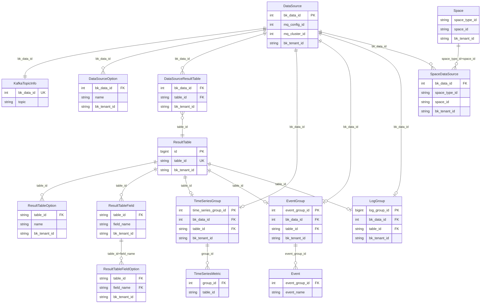
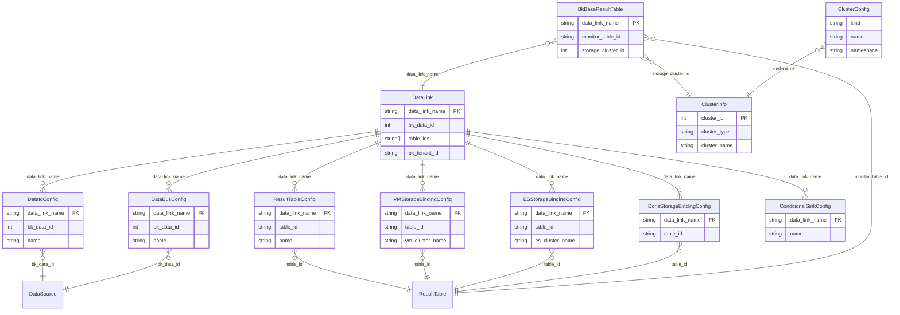

### Metadata表关系整理

基于 `DataSource` 构建数据链路表关系图（含字段级关联 + 逻辑归属/上游）。说明：
- **逻辑归属**：表示业务语义上的上下游关系，不等同于外键约束。
- **图谱拆分**：主图聚焦 datasource/resulttable/custom_group 主链路；其余表按“存储/快照/BCS/空间/DataLink”等子图拆分，避免过度拥挤。

#### 元数据主链路

#### 计算平台/DataLink 配置链路

#### 存储/快照链路

#### BCS 资源链路

#### 空间与资源链路

#### 未纳入关系图的表（待确认）
| 表(模型) | 原因/备注 |
|---|---|
| PingServerSubscriptionConfig | 仅订阅配置与主机信息，无直接 datasource/resulttable 关联 |
| CustomReportSubscriptionConfig | 已废弃订阅配置，无直接链路关联 |
| LogSubscriptionConfig | 订阅配置无显式 FK（仅 `bk_biz_id/log_name`） |
| SpaceStickyInfo | 用户置顶信息，与链路无关 |
| Label | 标签配置，非外键关系 |
| CustomRelationStatus | 自定义关联状态（通用元信息） |
| CustomReportSubscription | 自定义上报订阅 |

#### 无法归类到业务下的表（补充，待确认）
| 表(模型) | 原因/备注 |
|---|---|
| ClusterInfo | 集群信息，全局配置表 |
| SpaceType | 空间类型，全局配置表 |
| EsSnapshotRepository | ES 快照仓库配置，全局配置表 |
| ClusterConfig | 集群配置（DataLink），全局配置表 |
| Label | 标签配置，全局配置表 |
| CustomRelationStatus | 自定义关联状态，全局元信息 |
| PingServerSubscriptionConfig | 订阅配置，无直接关联 |
| CustomReportSubscription | 自定义上报订阅，无直接链路关联 |
| CustomReportSubscriptionConfig | 已废弃订阅配置，无直接链路关联 |
| SpaceStickyInfo | 用户置顶信息，与链路无关 |
| InfluxDBClusterInfo | InfluxDB 集群信息，全局配置表 |
| InfluxDBHostInfo | InfluxDB 主机信息，全局配置表 |
| InfluxDBProxyStorage | InfluxDB 代理存储，全局配置表 |
| InfluxDBTagInfo | InfluxDB 标签信息，全局配置表 |
| EntityMeta | 实体元信息，需特殊处理 |
