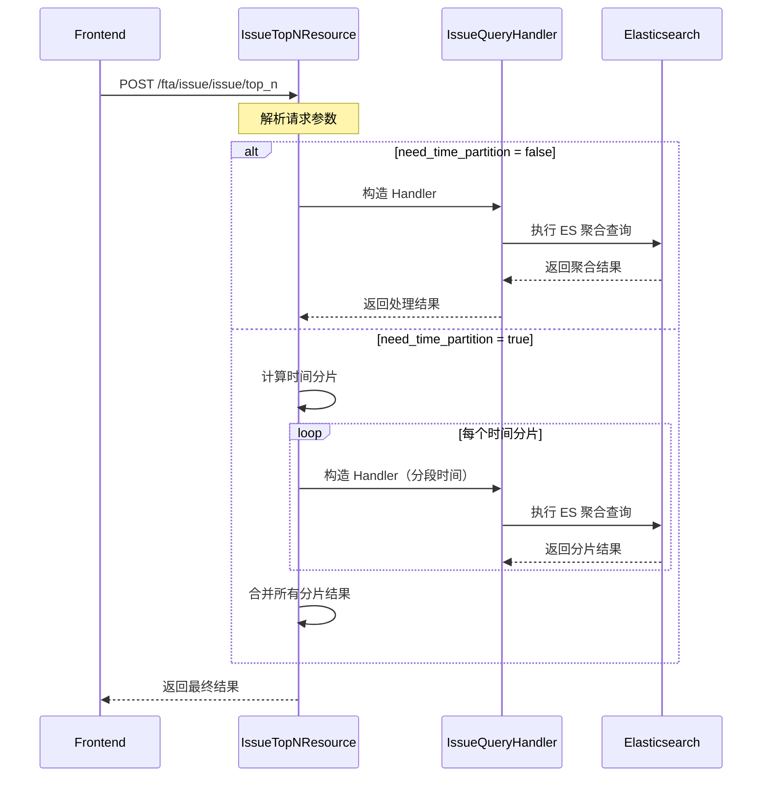

# Issue Top-N 接口设计文档

> **创建时间**：2026-04-16
> **状态**：设计完成
> **关联文档**：[Issue 列表接口设计](./Issues 列表接口设计.md) | [告警 TopN 实现](../alert/handlers/base.py)

---

## 1. 接口说明

Issue Top-N 接口用于统计 Issue 在各维度上的分布情况，支持按状态、优先级、负责人、标签等字段进行聚合分析。

### 1.1 接口清单

| 接口名 | Resource 类名 | HTTP | Endpoint | 说明 |
|--------|--------------|------|----------|------|
| Issue TopN 查询 | `IssueTopNResource` | POST | `/fta/issue/issue/top_n` | 支持 time_partition 参数控制是否时间分片 |

### 1.2 使用场景

| 场景 | 描述 | 示例 |
|------|------|------|
| 状态分布统计 | 查看各状态下的 Issue 数量 | 未解决 vs 已解决 vs 待审核 |
| 优先级分布 | 查看 P0/P1/P2 优先级分布 | 高优先级问题占比分析 |
| 负责人分布 | 查看各负责人名下的 Issue 分布 | 识别负载不均衡 |
| 标签分布 | 查看各标签下的 Issue 数量 | 识别高频问题类型 |
| 策略分布 | 查看各策略产生的 Issue 数量 | 识别问题高发策略 |

---

## 2. 架构设计

### 2.1 整体架构

Issue Top-N 复用告警 TopN 的基础架构，采用相同的分层设计：

```
┌─────────────────────────────────────────────────────────────┐
│                      Frontend                                │
│  (Issue 列表页 - 维度统计 Tab)                               │
└─────────────────────────────────────────────────────────────┘
                            │
                            ▼
┌─────────────────────────────────────────────────────────────┐
│   Resource Layer (fta_web/issue/resources.py)               │
│  ┌─────────────────────────────────────────────────────┐   │
│  │ IssueTopNResource                                    │   │
│  │ - 根据 need_time_partition 决定是否分片              │   │
│  │ - 不分片时直接调用 handler.top_n()                   │   │
│  │ - 分片时并行查询后合并结果                           │   │
│  └─────────────────────────────────────────────────────┘   │
└─────────────────────────────────────────────────────────────┘
                            │
                            ▼
┌─────────────────────────────────────────────────────────────┐
│   Handler Layer (fta_web/issue/handlers/issue.py)           │
│  ┌─────────────────────────────────────────────────────┐   │
│  │ IssueQueryHandler.top_n()                            │   │
│  │ - 继承 BaseBizQueryHandler.top_n()                   │   │
│  │ - 可选重写 translators 参数                          │   │
│  └─────────────────────────────────────────────────────┘   │
└─────────────────────────────────────────────────────────────┘
                            │
                            ▼
┌─────────────────────────────────────────────────────────────┐
│   Base Handler (fta_web/alert/handlers/base.py)             │
│  ┌─────────────────────────────────────────────────────┐   │
│  │ BaseBizQueryHandler.top_n()                          │   │
│  │ - ES 聚合查询                                        │   │
│  │ - 字段翻译                                           │   │
│  │ - 结果格式化                                         │   │
│  └─────────────────────────────────────────────────────┘   │
└─────────────────────────────────────────────────────────────┘
                            │
                            ▼
┌─────────────────────────────────────────────────────────────┐
│   Elasticsearch (IssueDocument)                             │
└─────────────────────────────────────────────────────────────┘
```

### 2.2 时间分片策略

与告警 TopN 一致，Issue TopN 支持按时间分片并行查询：

| 时间范围 | 分片策略 | 说明 |
|---------|---------|------|
| ≤ 7 天 | 不分片 | 单次查询完成 |
| > 7 天 | 按天分片 | 每天一个分片，并行查询后合并结果 |

**分片阈值**：`SLICED_THRESHOLD = 7 * 24 * 60 * 60`（7 天）

**分片合并逻辑**：
- `doc_count`：各分片累加
- `buckets`：按 bucket key 合并，`doc_count` 累加

---

## 3. 核心组件设计

### 3.1 IssueTopNResource

不再拆分为 IssueTopNResource + IssueTopNResultResource 两个接口，合并为一个 `IssueTopNResource`，内部根据 `need_time_partition` 参数决定是否分片。

```python
class IssueTopNResource(Resource):
    """Issue TopN 统计"""
    
    handler_cls = IssueQueryHandler
    
    class RequestSerializer(IssueSearchSerializer, BaseTopNResource.RequestSerializer):
        need_time_partition = serializers.BooleanField(
            required=False, 
            default=True, 
            label="是否需要按时间分片"
        )
    
    def perform_request(self, validated_request_data):
        # 解析业务权限
        if validated_request_data["bk_biz_ids"] is not None:
            authorized_bizs, unauthorized_bizs = self.handler_cls.parse_biz_item(validated_request_data["bk_biz_ids"])
            validated_request_data["authorized_bizs"] = authorized_bizs
            validated_request_data["unauthorized_bizs"] = unauthorized_bizs
        
        need_time_partition = validated_request_data.pop("need_time_partition")
        
        if not need_time_partition:
            # 不分片：直接调用 handler
            handler = self.handler_cls(**validated_request_data)
            return handler.top_n(
                fields=validated_request_data["fields"],
                size=validated_request_data["size"]
            )
        
        # 时间分片并行查询
        start_time = validated_request_data.pop("start_time")
        end_time = validated_request_data.pop("end_time")
        slice_times = slice_time_interval(start_time, end_time)
        
        results = []
        for sliced_start_time, sliced_end_time in slice_times:
            handler = self.handler_cls(
                start_time=sliced_start_time,
                end_time=sliced_end_time,
                **validated_request_data,
            )
            results.append(handler.top_n(
                fields=validated_request_data["fields"],
                size=validated_request_data["size"]
            ))
        
        # 合并分片结果
        return self._merge_results(results)
```

### 3.2 IssueQueryHandler.top_n()

```python
class IssueQueryHandler(BaseBizQueryHandler):
    """Issue 列表查询处理器"""
    
    query_transformer = IssueQueryTransformer
    
    def top_n(self, fields: list, size=10, translators: dict = None, char_add_quotes=True):
        """Issue TopN 查询，支持字段值翻译"""
        translators = translators or {
            "status": StatusTranslator(),      # 状态翻译
            "priority": PriorityTranslator(),  # 优先级翻译
            "bk_biz_id": BizTranslator(),      # 业务翻译
            "strategy_id": StrategyTranslator(), # 策略翻译
        }
        
        return super().top_n(fields, size, translators, char_add_quotes)
    
    def add_agg_bucket(self, search_object, field: str, size: int = 10):
        """按字段添加聚合桶，支持 impact_dimensions 和 impact_scope 特殊字段"""
        actual_field = field.lstrip("+-")

        if actual_field == "impact_dimensions":
            filters = {
                dim: Q("exists", field=f"impact_scope.{dim}")
                for dim, _ in ImpactScopeDimension.CHOICES
            }
            search_object.bucket("impact_dimensions", "filters", filters=filters)
            return

        if actual_field.startswith("impact_scope."):
            parts = actual_field.split(".")
            if len(parts) == 3 and parts[0] == "impact_scope":
                dimension, id_field = parts[1], parts[2]
                es_field = f"impact_scope.{dimension}.instance_list.{id_field}"
                search_object.bucket(actual_field, "terms", field=es_field, size=size)
                return

        # 其他字段走基类标准流程
        return super().add_agg_bucket(search_object, field, size)
```

### 3.4 字段翻译器

在 `fta_web/issue/handlers/translator.py` 中定义：

```python
class StatusTranslator(AbstractTranslator):
    """Issue 状态翻译"""
    
    def translate(self, value):
        return dict(IssueStatus.CHOICES).get(value, value)


class PriorityTranslator(AbstractTranslator):
    """Issue 优先级翻译"""
    
    def translate(self, value):
        return dict(IssuePriority.CHOICES).get(value, value)
```

---

## 4. 支持统计的字段

### 4.1 可用字段列表

| 字段 | 类型 | 说明 | 是否字符字段 |
|------|------|------|------------|
| `status` | Keyword | 状态（pending_review/unresolved/resolved/rejected） | 否 |
| `priority` | Keyword | 优先级（P0/P1/P2） | 否 |
| `assignee` | Keyword | 负责人（空字符串表示未指派） | 是 |
| `strategy_id` | Keyword | 策略 ID | 是 |
| `strategy_name` | Text.raw | 策略名称 | 是 |
| `bk_biz_id` | Keyword | 业务 ID | 是 |
| `labels` | Keyword[] | 标签（数组） | 是 |
| `is_regression` | Boolean | 是否回归 | 否 |
| `tags.*` | Keyword | 自定义标签（如 `tags.service`） | 是 |
| `id` | Keyword | Issue ID | 是 |
| `impact_dimensions` | Keyword[] | 影响范围维度统计 | 否 |
| `impact_scope.{维度}.{ID字段}` | Keyword | 影响范围实例 ID 统计（维度和 ID 字段由前端指定） | 是 |

### 4.2 字段说明

| 字段 | 注意事项 |
|------|---------|
| `assignee` | 空字符串表示"未指派"，前端需特殊处理 |
| `labels` | 数组字段，ES 聚合时会自动展开 |
| `tags.*` | 支持动态标签，需通过 `tags.` 前缀指定 |
| `strategy_name` | 使用 `.raw` 后缀进行精确聚合 |
| `id` | 标准 terms 聚合，标记为 is_char |
| `impact_dimensions` | 通过 `add_agg_bucket` 统一处理：使用 filters 聚合统计各维度存在性，与条件过滤逻辑一致 |
| `impact_scope.{维度}.{ID字段}` | 通过 `add_agg_bucket` 统一处理：路径映射到 `impact_scope.{dim}.instance_list.{id_field}` 走 terms 聚合，与条件过滤路径映射一致 |

---

### 4.3 特殊字段详细设计

#### 4.3.1 `id` 字段

`id` 为 Keyword 类型，走标准 terms 聚合，标记为 `is_char=True`。无需特殊处理。

---

#### 4.3.2 `impact_dimensions` 维度统计

**问题背景**：
- 需要统计 Issue 包含哪些影响范围维度（host/cluster/set 等）
- 每个维度在 ES 中是动态字段，存在于 `impact_scope.{dimension}` 路径下

**处理方案**：
- 通过重写 `add_agg_bucket()` 统一处理，无需额外特殊逻辑
- 使用 ES `filters` 聚合 + `exists` 查询，与 condition 过滤中 `impact_dimensions` 的 `exists` 查询逻辑一致
- 维度列表从 `ImpactScopeDimension.CHOICES` 获取，**维度固定为 9 个**
- 当请求 `impact_dimensions` 时，`size` 参数无效，始终返回全部 9 个维度（包括 count=0 的维度）

**维度列表**：

| 维度值 | 中文名 | 说明 |
|--------|--------|------|
| `set` | 集群 | 主机集群 |
| `host` | 主机 | 物理机/虚拟机 |
| `service_instances` | 服务实例 | 服务实例 |
| `cluster` | bcs集群 | K8s 集群 |
| `node` | node | K8s 节点 |
| `service` | service | K8s 服务 |
| `pod` | pod | K8s Pod |
| `apm_app` | apm_app | APM 应用 |
| `apm_service` | apm_service | APM 服务 |

**ES 查询逻辑**（通过 `add_agg_bucket` 统一处理，与 condition 过滤逻辑一致）：
```python
# IssueQueryHandler.add_agg_bucket() 中处理 impact_dimensions
if actual_field == "impact_dimensions":
    filters = {
        dim: Q("exists", field=f"impact_scope.{dim}")
        for dim, _ in ImpactScopeDimension.CHOICES
    }
    search_object.bucket("impact_dimensions", "filters", filters=filters)
    return
```

**返回格式**：
```json
{
    "field": "impact_dimensions",
    "is_char": false,
    "bucket_count": 9,
    "buckets": [
        {"id": "host", "name": "主机", "count": 150},
        {"id": "cluster", "name": "bcs集群", "count": 80},
        {"id": "set", "name": "集群", "count": 60},
        {"id": "pod", "name": "pod", "count": 45},
        {"id": "service", "name": "service", "count": 30},
        {"id": "node", "name": "node", "count": 25},
        {"id": "service_instances", "name": "服务实例", "count": 20},
        {"id": "apm_app", "name": "apm_app", "count": 10},
        {"id": "apm_service", "name": "apm_service", "count": 5}
    ]
}
```

**Translator**：
- 使用 `ImpactScopeDimension.get_display_name(dimension)` 翻译为中文名

---

#### 4.3.3 `impact_scope.{维度}.{ID字段}` 的 Top-N

**问题背景**：
- 需要统计每个维度下具体实例的 Issue 分布
- 例如：哪些主机产生的 Issue 最多
- ES 路径需要映射，且返回时需要将 ID 翻译为展示名（如 bk_host_id → IP）

**处理方案**：
- 通过重写 `add_agg_bucket()` 统一处理，与 condition 过滤中的路径映射逻辑一致
- 路径映射：`impact_scope.{dimension}.{id_field}` → `impact_scope.{dimension}.instance_list.{id_field}`
- 使用标准 terms 聚合

**注意**：`impact_scope` 使用 Flattened 类型，所有叶子节点值被索引为 keyword，可直接对 `impact_scope.{dimension}.instance_list.{id_field}` 做 terms 聚合，无需 nested 聚合。

**9 个维度的 ID 字段映射表**（基于 `issue_tasks.py` 中 `_build_impact_scope()` 的实际数据结构）：

| 维度 | ID 字段 | ES 聚合路径 | instance_list 其他字段 | 展示名示例 |
|------|---------|-------------|----------------------|------------|
| `set` | `set_id` | `impact_scope.set.instance_list.set_id` | `display_name` | 集群名称 |
| `host` | `bk_host_id` | `impact_scope.host.instance_list.bk_host_id` | `display_name` | IP/主机名 |
| `service_instances` | `bk_service_instance_id` | `impact_scope.service_instances.instance_list.bk_service_instance_id` | `display_name` | 实例名称 |
| `cluster` | `bcs_cluster_id` | `impact_scope.cluster.instance_list.bcs_cluster_id` | `display_name` | 集群名称 |
| `node` | `node` | `impact_scope.node.instance_list.node` | `bcs_cluster_id`, `display_name` | 节点名称 |
| `service` | `service` | `impact_scope.service.instance_list.service` | `bcs_cluster_id`, `display_name` | 服务名称 |
| `pod` | `pod` | `impact_scope.pod.instance_list.pod` | `bcs_cluster_id`, `display_name` | Pod 名称 |
| `apm_app` | `app_name` | `impact_scope.apm_app.instance_list.app_name` | `bk_biz_id`, `display_name` | 应用名称 |
| `apm_service` | `service_name` | `impact_scope.apm_service.instance_list.service_name` | `app_name`, `bk_biz_id`, `display_name` | 服务名称 |

**字段格式说明**：
- 请求字段格式：`impact_scope.{dimension}.{id_field}`
- `dimension` 和 `id_field` 由前端传入具体值
- 示例：`impact_scope.host.bk_host_id`、`impact_scope.cluster.bcs_cluster_id`

**ES 查询逻辑**（通过 `add_agg_bucket` 统一处理，路径映射与 condition 过滤一致）：
```python
# IssueQueryHandler.add_agg_bucket() 中处理 impact_scope.{dim}.{id_field}
if actual_field.startswith("impact_scope."):
    parts = actual_field.split(".")
    if len(parts) == 3 and parts[0] == "impact_scope":
        dimension, id_field = parts[1], parts[2]
        es_field = f"impact_scope.{dimension}.instance_list.{id_field}"
        search_object.bucket(actual_field, "terms", field=es_field, size=size)
        return
```

**返回格式**：
```json
{
    "field": "impact_scope.host.bk_host_id",
    "is_char": true,
    "bucket_count": 10,
    "buckets": [
        {"id": "1001", "name": "192.168.1.101", "count": 25},
        {"id": "1002", "name": "192.168.1.102", "count": 18},
        {"id": "1003", "name": "192.168.1.103", "count": 12}
    ]
}
```

**Translator 实现**（后端处理 ID→展示名翻译）：

Owner 确认由后端负责翻译。翻译策略分为两类：

**策略一：从 ES 已有数据中翻译（优先）**

`instance_list` 中已存储了 `display_name` 字段，可通过 `top_hits` 子聚合获取。但 terms 聚合无法直接携带子文档信息，因此需要分步：
1. 先通过 terms 聚合获取 Top-N 的 ID 列表
2. 再根据维度类型调用对应的翻译接口批量翻译

**策略二：调用外部接口翻译**

| 维度 | 翻译方式 | 数据来源 |
|------|---------|----------|
| `host` | CMDB 批量查询主机 | `bk_host_id` → IP/主机名 |
| `set` | CMDB 批量查询集群 | `set_id` → 集群名称 |
| `service_instances` | CMDB 批量查询服务实例 | `bk_service_instance_id` → 实例名称 |
| `cluster` | 容器平台 API | `bcs_cluster_id` → 集群名称 |
| `node` | 容器平台 API | `bcs_cluster_id` + `node` → 节点名称 |
| `service` | 容器平台 API | `bcs_cluster_id` + `service` → 服务名称 |
| `pod` | 容器平台 API | `bcs_cluster_id` + `pod` → Pod 名称 |
| `apm_app` | APM 服务 | `app_name` → 应用名称 |
| `apm_service` | APM 服务 | `service_name` → 服务名称 |

**Translator 基类**：
```python
class ImpactScopeTranslator(AbstractTranslator):
    """影响范围实例 ID 翻译器基类"""
    
    def __init__(self, dimension: str, id_field: str):
        self.dimension = dimension
        self.id_field = id_field
```

各维度具体 Translator 在实现阶段根据可用 API 编写，翻译失败时降级返回原始 ID 值。

**使用示例**：
```json
{
    "bk_biz_ids": [2],
    "fields": ["impact_scope.host.bk_host_id", "impact_scope.cluster.bcs_cluster_id"],
    "size": 10
}
```

---

### 4.4 字段分类汇总

| 分类 | 字段 | 聚合方式 | 是否需要 Translator |
|------|------|---------|-------------------|
| 普通字段 | id, status, priority, assignee, strategy_id, strategy_name, bk_biz_id, labels, is_regression, tags.* | terms | 是 |
| 普通字段（add_agg_bucket 扩展） | impact_dimensions | filters + exists | 是（dim→display_name） |
| 普通字段（add_agg_bucket 扩展） | impact_scope.{dim}.{id_field} | terms（Flattened 路径，插入 instance_list） | 是（后端翻译：ID→display_name） |

---

## 5. 接口详细设计

### 5.1 RequestSerializer

```python
class RequestSerializer(IssueSearchSerializer, BaseTopNResource.RequestSerializer):
    """Issue TopN 请求序列化器"""
    
    # 继承自 IssueSearchSerializer
    bk_biz_ids = serializers.ListField(label="业务 ID 列表", child=serializers.IntegerField())
    status = serializers.ListField(label="状态过滤", child=serializers.CharField(), required=False)
    conditions = SearchConditionSerializer(label="搜索条件", many=True, default=[])
    query_string = serializers.CharField(label="查询字符串", default="", allow_blank=True)
    start_time = serializers.IntegerField(label="开始时间", required=False)
    end_time = serializers.IntegerField(label="结束时间", required=False)
    
    # 继承自 BaseTopNResource.RequestSerializer
    fields = serializers.ListField(
        label="查询字段列表",
        child=serializers.CharField(),
        default=[]
    )
    size = serializers.IntegerField(
        label="获取的桶数量",
        default=10
    )
    
    # Issue TopN 特有
    need_time_partition = serializers.BooleanField(
        required=False,
        default=True,
        label="是否需要按时间分片"
    )
```

#### 字段说明

| 字段 | 类型 | 必填 | 默认值 | 说明 |
|------|------|:----:|--------|------|
| `bk_biz_ids` | `int[]` | 是 | - | 业务 ID 列表，用于权限过滤 |
| `fields` | `string[]` | 是 | - | 需要统计的字段列表，支持 `+`/`-` 前缀控制排序 |
| `size` | `int` | 否 | `10` | 每个字段返回的 Top N 数量，最大 10000 |
| `start_time` | `int` | 否 | - | 开始时间戳（秒级），用于时间范围过滤 |
| `end_time` | `int` | 否 | - | 结束时间戳（秒级），用于时间范围过滤 |
| `need_time_partition` | `bool` | 否 | `true` | 是否启用时间分片（>7 天自动分片） |
| `status` | `string[]` | 否 | - | 状态过滤，支持 `MY_ISSUE` / `NO_ASSIGNEE` 虚拟状态 |
| `conditions` | `object[]` | 否 | - | 高级过滤条件 |
| `query_string` | `string` | 否 | `""` | ES 查询字符串 |

### 5.2 返回值结构

```json
{
    "doc_count": 150,
    "fields": [
        {
            "field": "status",
            "is_char": false,
            "bucket_count": 4,
            "buckets": [
                {
                    "id": "unresolved",
                    "name": "未解决",
                    "count": 80
                },
                {
                    "id": "pending_review",
                    "name": "待审核",
                    "count": 40
                },
                {
                    "id": "resolved",
                    "name": "已解决",
                    "count": 25
                },
                {
                    "id": "rejected",
                    "name": "拒绝",
                    "count": 5
                }
            ]
        },
        {
            "field": "priority",
            "is_char": false,
            "bucket_count": 3,
            "buckets": [
                {
                    "id": "P0",
                    "name": "高",
                    "count": 20
                },
                {
                    "id": "P1",
                    "name": "中",
                    "count": 60
                },
                {
                    "id": "P2",
                    "name": "低",
                    "count": 70
                }
            ]
        }
    ]
}
```

#### 顶层字段

| 字段 | 类型 | 说明 |
|------|------|------|
| `doc_count` | `int` | 符合条件的 Issue 总数 |
| `fields` | `object[]` | 各字段的统计结果数组 |

#### fields 数组单项

| 字段 | 类型 | 说明 |
|------|------|------|
| `field` | `string` | 字段名 |
| `is_char` | `bool` | 是否为字符字段 |
| `bucket_count` | `int` | 桶数量（实际返回的 bucket 数量） |
| `buckets` | `object[]` | 桶数组 |

#### buckets 数组单项

| 字段 | 类型 | 说明 |
|------|------|------|
| `id` | `string` | 桶 ID（字段原始值） |
| `name` | `string` | 桶名称（翻译后的展示名） |
| `count` | `int` | 该桶的文档数量 |

---

## 6. 调用流程图



---

## 7. 请求示例

### 示例 1：统计状态分布

```json
{
    "bk_biz_ids": [2],
    "fields": ["status"],
    "size": 10,
    "start_time": 1741334400,
    "end_time": 1741420800,
    "need_time_partition": false
}
```

### 示例 2：统计优先级和负责人分布

```json
{
    "bk_biz_ids": [2],
    "fields": ["priority", "assignee"],
    "size": 20,
    "need_time_partition": true
}
```

### 示例 3：统计标签分布（多值字段）

```json
{
    "bk_biz_ids": [2],
    "fields": ["labels"],
    "size": 50,
    "start_time": 1740729600,
    "end_time": 1741420800
}
```

### 示例 4：带过滤条件的策略分布

```json
{
    "bk_biz_ids": [2],
    "fields": ["strategy_name"],
    "size": 20,
    "status": ["unresolved"],
    "conditions": [
        {
            "key": "priority",
            "value": ["P0", "P1"],
            "method": "include"
        }
    ]
}
```

### 示例 5：长时间范围（自动分片）

```json
{
    "bk_biz_ids": [2],
    "fields": ["status", "priority"],
    "size": 10,
    "start_time": 1738339200,
    "end_time": 1741420800,
    "need_time_partition": true
}
```

---

## 8. 设计要点

### 8.1 分片合并逻辑

```python
def _merge_results(self, results: list) -> dict:
    """合并多个时间分片的 TopN 结果"""
    result = {
        "doc_count": 0,
        "fields": []
    }
    field_buckets_map = {}
    
    for sliced_result in results:
        result["doc_count"] += sliced_result["doc_count"]
        
        for field_info in sliced_result["fields"]:
            field = field_info["field"]
            if field not in field_buckets_map:
                field_buckets_map[field] = {
                    "field": field,
                    "is_char": field_info["is_char"],
                    "bucket_count": 0,
                    "buckets": {}  # 用 dict 便于按 key 合并
                }
            
            # 合并 buckets
            for bucket in field_info["buckets"]:
                key = bucket["id"]
                if key not in field_buckets_map[field]["buckets"]:
                    field_buckets_map[field]["buckets"][key] = {
                        "id": bucket["id"],
                        "name": bucket["name"],
                        "count": 0
                    }
                field_buckets_map[field]["buckets"][key]["count"] += bucket["count"]
    
    # 转换为列表并按 count 排序
    for field_data in field_buckets_map.values():
        buckets_list = list(field_data["buckets"].values())
        buckets_list.sort(key=lambda x: x["count"], reverse=True)
        field_data["bucket_count"] = len(buckets_list)
        field_data["buckets"] = buckets_list
        result["fields"].append(field_data)
    
    return result
```

### 8.2 字段翻译

```python
# 在 IssueQueryHandler.top_n() 中
translators = {
    "status": StatusTranslator(),      # pending_review → 待审核
    "priority": PriorityTranslator(),  # P0 → 高
    "bk_biz_id": BizTranslator(),      # 2 → 业务名称
    "strategy_id": StrategyTranslator(), # 1001 → 策略名称
}
```

### 8.3 特殊字段处理

| 字段 | 处理方式 |
|------|---------|
| `assignee` | 空字符串桶展示为"未指派" |
| `labels` | 多值字段，ES 自动展开聚合 |
| `tags.*` | 动态字段，需使用完整路径如 `tags.service` |
| `strategy_name` | 使用 `.raw` 后缀进行精确聚合 |
| `impact_dimensions` | 通过 `add_agg_bucket` 统一处理：filters 聚合 + exists 查询统计各维度 |
| `impact_scope.{维度}.{ID字段}` | 通过 `add_agg_bucket` 统一处理：路径映射 `→ instance_list.{id_field}` + terms 聚合 |

#### impact_dimensions 和 impact_scope.{维度}.{ID字段} 统一处理代码示例

```python
def add_agg_bucket(self, search_object, field: str, size: int = 10):
    """按字段添加聚合桶，支持 impact_dimensions 和 impact_scope 特殊字段"""
    actual_field = field.lstrip("+-")

    if actual_field == "impact_dimensions":
        filters = {
            dim: Q("exists", field=f"impact_scope.{dim}")
            for dim, _ in ImpactScopeDimension.CHOICES
        }
        search_object.bucket("impact_dimensions", "filters", filters=filters)
        return

    if actual_field.startswith("impact_scope."):
        parts = actual_field.split(".")
        if len(parts) == 3 and parts[0] == "impact_scope":
            dimension, id_field = parts[1], parts[2]
            es_field = f"impact_scope.{dimension}.instance_list.{id_field}"
            search_object.bucket(actual_field, "terms", field=es_field, size=size)
            return

    # 其他字段走基类标准流程
    return super().add_agg_bucket(search_object, field, size)
```

---

## 9. 开发任务拆解

| Task | 内容 | 依赖 |
|------|------|------|
| **Task 1** | 实现 `IssueTopNResource`（不分片直接调用 + 分片并行查询合并） | 无 |
| **Task 2** | 实现 `StatusTranslator` 和 `PriorityTranslator` | 无 |
| **Task 3** | 在 `IssueQueryHandler` 中重写 `top_n()` 和 `add_agg_bucket()` 方法（含 impact_dimensions / impact_scope.{dim}.{id_field} 统一处理） | Task 2 |
| **Task 4** | 在 `views.py` 中注册路由 | Task 1 |
| **Task 5** | 实现 ImpactScope 相关 Translators（HostTranslator, ClusterTranslator 等） | Task 3 |

---

## 10. 与告警 TopN 的对比

| 特性 | 告警 TopN | Issue TopN |
|------|----------|-----------|
| 基础架构 | `BaseTopNResource` | 复用 |
| 时间分片 | 支持（>7 天） | 支持（>7 天） |
| 字段翻译 | metric/bk_biz_id/strategy_id 等 | status/priority/bk_biz_id/strategy_id |
| 文档类型 | `AlertDocument` | `IssueDocument` |
| 虚拟状态 | 无 | `MY_ISSUE` / `NO_ASSIGNEE` |
| 多值字段 | `tags.*` | `labels`, `tags.*` |
| 特殊字段 | 无 | 无（所有字段走标准聚合或 add_agg_bucket 扩展） |
| add_agg_bucket 扩展 | 无 | `impact_dimensions`（filters 聚合）/ `impact_scope.{维度}.{ID字段}`（路径映射 + terms 聚合） |

---

## 11. 注意事项

### 11.1 性能考虑

| 项 | 建议 |
|------|------|
| 单次查询字段数 | ≤ 5 个 |
| size 最大值 | 10000（硬限制） |
| 时间范围 > 7 天 | 自动启用分片 |
| 标签字段统计 | 建议限制 `size ≤ 50` |

### 11.2 权限控制

- `bk_biz_ids` 用于业务权限过滤
- 负责人可见无权限业务的 Issue（需配合 `MY_ISSUE` 状态）
- 越权访问返回空结果

### 11.3 数据一致性

- `doc_count` 为各分片累加值
- 跨天查询时，分片边界可能产生统计误差（< 1%）
- 实时性：ES 近实时（NRT），延迟 < 1s

---

## 12. 前端使用建议

### 12.1 展示形式

```
┌────────────────────────────────────────────────┐
│  Issue 维度统计                                │
├────────────────────────────────────────────────┤
│  状态分布          优先级分布                   │
│  ┌──────────┐     ┌──────────┐                │
│  │ 待审核 40 │     │ P0  20   │                │
│  │ 未解决 80 │     │ P1  60   │                │
│  │ 已解决 25 │     │ P2  70   │                │
│  │ 拒绝   5  │     └──────────┘                │
│  └──────────┘                                  │
├────────────────────────────────────────────────┤
│  负责人分布          标签分布                   │
│  ┌──────────┐     ┌──────────┐                │
│  │ 张三  30  │     │ 网络  50  │                │
│  │ 李四  25  │     │ 存储  30  │                │
│  │ 未分配 45 │     │ 计算  20  │                │
│  └──────────┘     └──────────┘                │
└────────────────────────────────────────────────┘
```

### 12.2 交互建议

1. **点击下钻**：点击某个 bucket 可过滤列表
2. **多选支持**：支持按住 Ctrl 多选
3. **排序切换**：支持按 count 升序/降序
4. **时间范围联动**：切换时间范围自动刷新统计

---

## 13. 附录

### 13.1 IssueStatus 枚举

| 值 | 中文名 | 说明 |
|------|--------|------|
| `pending_review` | 待审核 | 初始状态，负责人未指派 |
| `unresolved` | 未解决 | 已指派负责人，跟进中 |
| `resolved` | 已解决 | 人工标记已解决 |
| `rejected` | 拒绝 | 无效 Issue |

### 13.2 IssuePriority 枚举

| 值 | 中文名 | 说明 |
|------|--------|------|
| `P0` | 高 | 最高优先级 |
| `P1` | 中 | 中等优先级 |
| `P2` | 低 | 默认优先级 |

### 13.3 虚拟状态

| 值 | 说明 |
|------|------|
| `MY_ISSUE` | 我负责的 Issue（assignee=当前用户） |
| `NO_ASSIGNEE` | 未分派的 Issue（assignee 为空） |

---

**文档结束**
