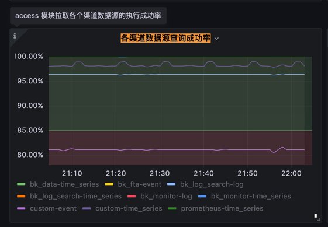

# SLI 快速开始 

## 启用 sli 仪表盘

- 正常部署监控后，监控仪表盘讲默认被内置到监控的蓝鲸业务下的仪表盘中。
- 如果在蓝鲸业务下，未找到名为: `[BlueKing]蓝鲸监控平台-后台 SLI`的仪表盘。则可以通过导入启动 sli 仪表盘

### 导入 sli 仪表盘
1. 通过上传文件导入（点击按钮`Upload JSON file`）

2. 复制文件内容导入（将
[[BlueKing]蓝鲸监控平台-后台-SLI.json](dashboard%2F%5BBlueKing%5D%E8%93%9D%E9%B2%B8%E7%9B%91%E6%8E%A7%E5%B9%B3%E5%8F%B0-%E5%90%8E%E5%8F%B0-SLI.json)内容复制后，粘贴在`Import via panel json`文本框中，点击`Load`按钮
3. 加载仪表盘后，需要选择一个监控数据源， 选择上 `蓝鲸监控-指标数据` 即可
4. 如果仪表盘已经存在，则会有红色的冲突提示，此时按第 3 步，选择数据源后，点击红色按钮`Import(Overwrite)` 即可覆盖原仪表盘进行升级。

## sli 仪表盘说明

sli 仪表盘分为 4 类指标
- Errors/Errors(Time Series)
  - 展示错误率相关指标，包含当前状态: Errors和历史趋势: Errors(Time Series)
- Traffic
  - 展示当前各模块处理流量
- Latency
  - 展示当前各模块处理延迟及耗时
- Saturation
  - 🚧: 容量相关(施工中)

### Errors（错误）

Errors分类下有 3 张视图：

- 各渠道数据源查询成功率
- 数据拉取至告警生成处理成功率
- 告警处理成功率

Errors同时提供了2种数据视图： 当前成功率：Errors 和 成功率的时序曲线：Errors(Time Series) 

#### 各渠道数据源查询成功率
以下列出当前支持的数据查询渠道
* bk_data-time_series: 计算平台时序数据
* bk_fta-event: 关联策略查询
* bk_log_search-log: 日志平台的日志关键词查询
* bk_log_search-time_series: 日志平台的指标聚合查询 
* bk_monitor-log: 日志关键字
* bk_monitor-time_series: 监控内置/采集指标 
* custom-event: 自定义事件
* custom-time_series: 自定义指标
* prometheus-time_series: promql查询

按数据来源可以分为：
1. 监控自有数据
   - 时序db: `bk_monitor-time_series`, `custom-time_series`,  `prometheus-time_series`
   - ES: `bk_monitor-log`, `custom-event`
2. 第三方数据源
   - 日志平台（bk-log search）: `bk_log_search-log`, `bk_log_search-time_series`
   - 基础平台（bk-base）: `bk_data-time_series`

> Errors(Time Series)下，成功率在红色阈值下的渠道需要关注，如果成功率在红色区域，但一直稳定，则可能是告警策略对应的数据源已经失效。此时转到运营事项（清理无效的策略）

根据不同渠道的成功率下降引发的问题，可以基于一下目录寻找解决思路：
- 🚧[自有数据时序 db]()
- 🚧[自有 ES]()
- 🚧[日志平台]()
- 🚧[基础平台]()
    
#### 数据拉取至告警生成处理成功率

#### 告警处理成功率
