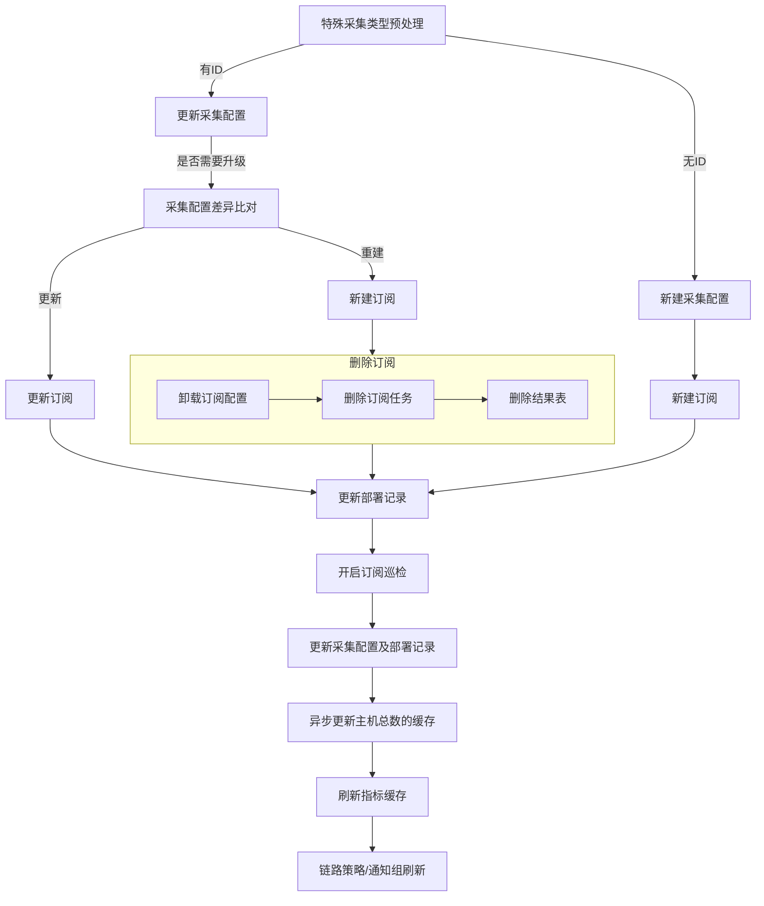
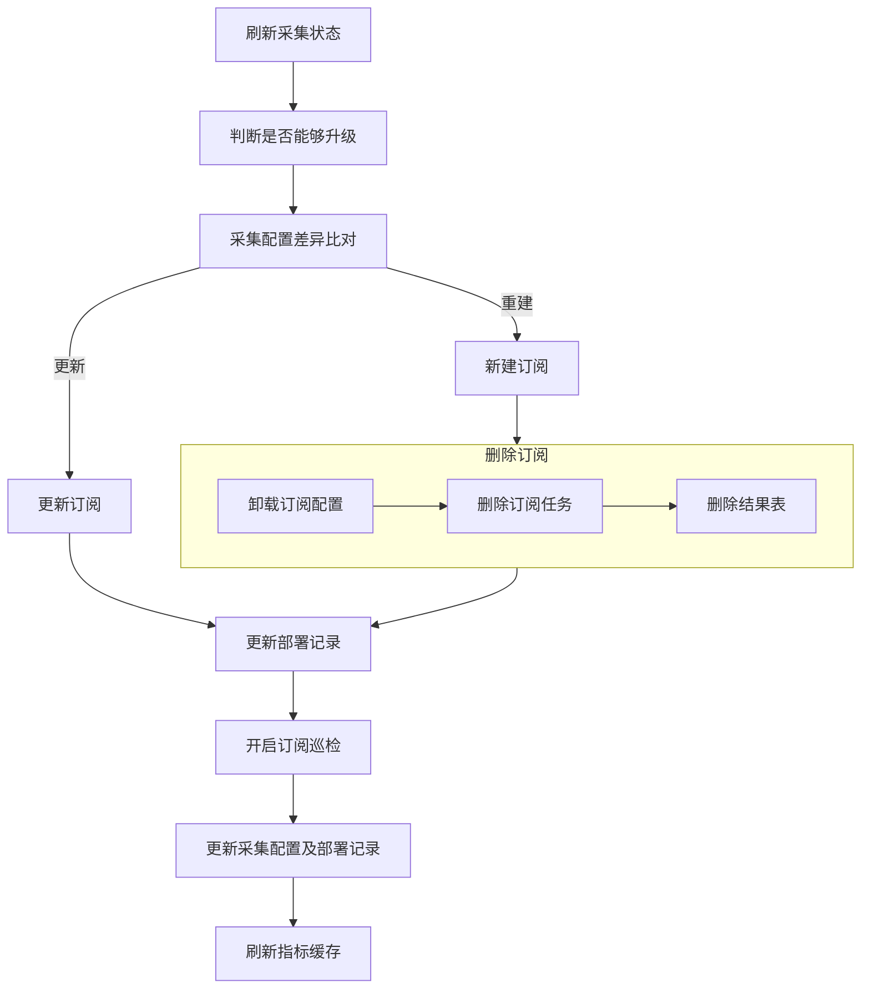
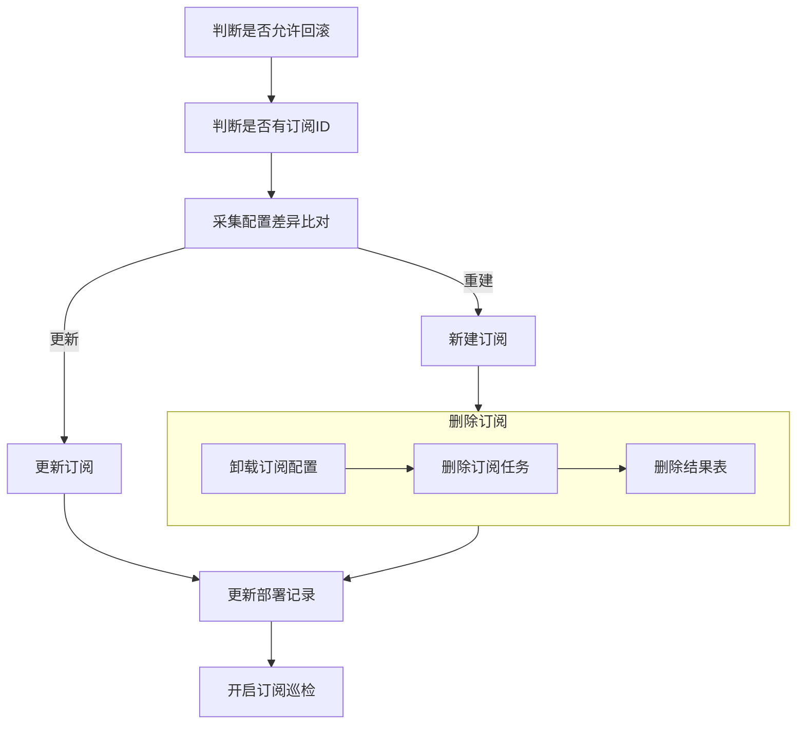

## 插件采集相关流程

#### SaveCollectConfig

```mermaid
graph TB
    A[特殊采集类型预处理]
    B[更新采集配置]
    C[新建采集配置]
    D[采集配置差异比对]
    E[更新订阅]
    F[新建订阅]
    subgraph G[删除订阅]
        卸载订阅配置 --> 删除订阅任务 --> 删除结果表
    end

    A -->|有ID| B
    A -->|无ID| C
    B -->|是否需要升级| D
    D -->|更新| E
    D -->|重建| F
    F --> G
    G --> H[更新部署记录]
    E --> H
    H --> I[开启订阅巡检]
    I --> J[更新采集配置及部署记录]
    J --> K[异步更新主机总数的缓存]
    K --> L[刷新指标缓存]
    L --> M[链路策略/通知组刷新]
    C --> N[新建订阅]
    N --> H
```

#### UpgradeCollectPlugin

```mermaid
graph TB
    A[刷新采集状态]
    B[判断是否能够升级]
    D[采集配置差异比对]
    E[更新订阅]
    F[新建订阅]
    subgraph G[删除订阅]
        卸载订阅配置 --> 删除订阅任务 --> 删除结果表
    end

    A --> B
    B --> D
    D -->|更新| E
    D -->|重建| F
    F --> G
    G --> H[更新部署记录]
    E --> H
    H --> I[开启订阅巡检]
    I --> J[更新采集配置及部署记录]
    J --> L[刷新指标缓存]
```

#### RollbackDeploymentConfig

```mermaid
graph TB
    A[判断是否允许回滚]
    B[判断是否有订阅ID]
    D[采集配置差异比对]
    E[更新订阅]
    F[新建订阅]
    subgraph G[删除订阅]
        卸载订阅配置 --> 删除订阅任务 --> 删除结果表
    end

    A --> B
    B --> D
    D -->|更新| E
    D -->|重建| F
    F --> G
    G --> H[更新部署记录]
    E --> H
    H --> I[开启订阅巡检]
```

#### 采集状态

采集起始状态: PREPARING

通过调用 IsTaskReady 实时判断任务状态
