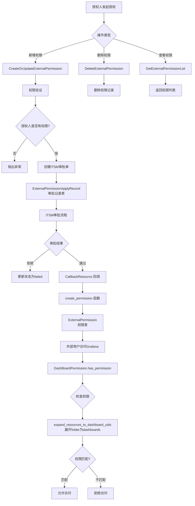

# garafana的权限

## 原生grafana权限构成

```
主要依赖permission表， permission表中有两个重要字段 action 和 scope
action： 用于判断当前操作涉及到什么资源 例如 dashboards:read, 就代表这个操作是仪表盘的读权限
scope：  用于补充对应action的操作范围 例如 folders:uid:Lbf6j5guhdcmwwc 就代表这个读权限的范围是 uid为uidLbf6j5guhdcmww的目录
最后 因为grafana是 基于 RBAC 的权限管理， 这就意味着权限是被分配给角色的， 可以通过
role_id 去判断当前权限分配给了哪一个角色
```

## iam与grafana的权限同步

```
主要的逻辑存在于 bk_dataview/views.py/initial 方法
这个方法会在每次操作grafana时被调用

# 同步权限
self.sync_permissions(request)
inital会调用sync_permissions方法去同步grafana与iam的权限
```

> sync_permissions方法的调用链如下

```
sync_permissions()
    │
    ▼
DashboardPermission.has_permission()       ◄─── 这里触发权限解析
    │
    ▼
DashboardPermission.get_user_permission()  ◄─── 这里进行 folder 展开
    │
    ▼
返回 dashboard_permissions（已展开）
    │
    ▼
sync_dashboard_permission(permissions)     ◄─── 接收的已经是展开后的

所以实际上， 这个方法就是调用DashBoardPermission的一系列方法， 获得当前用户拥有的权限
然后合并到grafana
```

> 从调用链可知，sync的操作依赖与DashBoardPermussion类， 他会从iam中获取权限策略， 并解析为程序可读的形式， 最后通过比较现有grafana权限， 和iam的权限， 去补充/删除新的权限到permission表中

## 添加对目录的权限校验

```
1. 修改dashboard对应的provider， 使其在返回dashboard的同时， 也展示folder
   ----  细节：在前端展示时， 通过 [仪表盘] xxx   [目录] xxx 的形式展示
2. 修改 DashboardPermission的多个方法， 使其在解析iam策略时
   能够兼容 folder 的解析
3. 修改packages/...resources/manage.py中的方法， 在返回字段中添加 has_permission， 用于表明当前目录是否拥有权限

4.申请folder权限  Folder 格式: "folder:{org_id}|{folder_id}"
// 申请 Folder 权限
{
    "action_ids": ["view_single_dashboard"],  // 或 "edit_single_dashboard"
    "resources": [
    {
    "type": "grafana_dashboard",
    "id": "folder:123|456"        // Folder 格式: "folder:{org_id}|{folder_id}"
    }
  ]
}

// 申请编辑 General 目录的权限
{
    "bk_biz_id": 2,
    "action_ids": ["edit_single_dashboard"],
    "resources": [
    {
    "type": "grafana_dashboard",
    "id": "folder:1|1"  
    }
  ]
}
```

## Grafana的外部用户权限(ExternalPermission)

### 关键类

1. packages/monitor_web/iam/resources.py
   > 该类中提供了多个对外接口， 可用于 新增/删除/查询 外部用户对grafana的权限
   >
2. bkmonitor/models/external_iam.py/Externalpermission
   > 该类用于记录外部用户的grafana的权限表
   >

```
action_id: 指定操作类型
resources: 存储dashboard_id或者folder_id
    # 1. dashboard: "{org_id}|{uid}" 格式（推荐，与 IAM 一致）或纯 "{uid}" 格式
    #    例如: "1|abc123" 或 "abc123"
    # 2. folder: "folder:{org_id}|{folder_id}" 格式
    #    例如: "folder:1|123"
```

### 关键数据流


