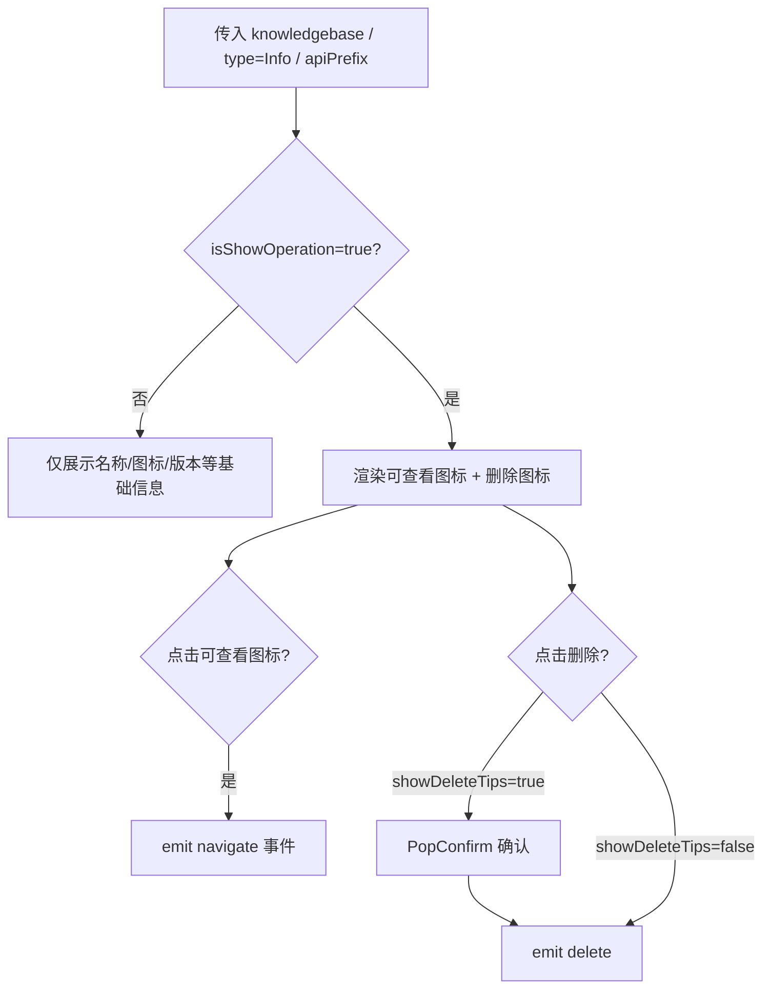
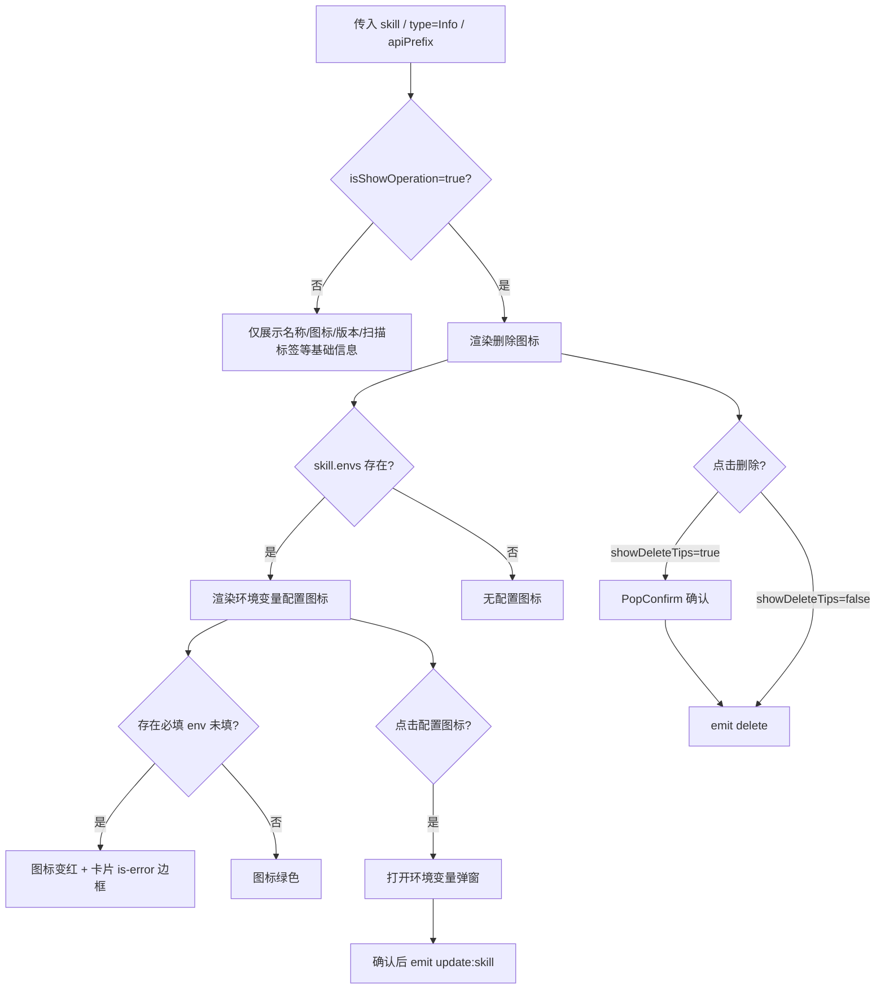

# @blueking/ai-ui-sdk 资源卡片使用说明（Info 模式专用）

> 版本：`0.4.1-beta.19`
> 来源：`@blueking/ai-ui-sdk/components` 中的 `RenderAgentCard`、`RenderKnowledgebaseCard`、`RenderSkillCard`
> 配套文件：[analysis-config-sideslider.tsx](./analysis-config-sideslider.tsx)
> 范围：本文档只梳理项目中实际使用的 **`ResourceCardType.Info`** 模式，其他模式（`full` / `choose` / `application` / `record` / `market`）不在本文范围内。

---

## 一、公共说明

### 1.1 资源状态 `ResourceStatus`

| 取值 | 含义 |
|------|------|
| `ready` | 正常可用 |
| `deleted` | 已归档/已删除 |
| `no_permission` | 无权限 |
| `permission-pending` | 权限审批中 |

### 1.2 三个卡片的公共必传属性

在 `Info` 模式下，`RenderAgentCard`、`RenderKnowledgebaseCard`、`RenderSkillCard` 都必须传入：

| 属性 | 类型 | 说明 |
|------|------|------|
| `type` | `ResourceCardType` | 固定传 `ResourceCardType.Info` |
| `apiPrefix` | `string` | 接口前缀，所有内部 HTTP 请求都会拼接该前缀 |
| 资源数据 | `IAgent` / `IKnowledgebase` / `ISkill` | 对应卡片的数据对象：`agent` / `knowledgebase` / `skill` |

### 1.3 三个卡片的公共可选属性

| 属性 | 类型 | 说明 |
|------|------|------|
| `isShowOperation` | `boolean` | 是否展示右上角操作区；项目内统一传 `true` |
| `showDeleteTips` | `boolean` | 删除时是否使用 `bk-pop-confirm` 二次确认；项目内统一传 `false` |
| `disabled` | `boolean` | 是否禁用，影响部分图标/卡片的可用态 |
| `spaceId` | `string` | 当前空间 ID；内部请求会自动作为 `x-space-id` 请求头 |
| `spaces` | `ISpace[]` | 空间列表，用于显示空间名称 |
| `defaultIcon` | `string` | 默认图标 URL |

> 注：`checked` / `multiple` / `isShowCheckbox` / `isClickToView` / `showGenerateType` 等属性在 `Info` 模式下也会透传给底层 `RenderBase`，但在当前项目只读展示/删除场景中不会使用，通常保持默认即可。

---

## 二、`apiPrefix` 接口路径约定

组件内部所有请求都基于同一个 `apiPrefix` 拼接，最终 URL 格式统一为：

```text
{apiPrefix}/{模块}/{版本}/{资源路径}/
```

例如 `apiPrefix = ''` 时，Agent 删除接口就是 `/agent/v1/agent/{id}/`；如果 `apiPrefix = '/api/ai'` 则变成 `/api/ai/agent/v1/agent/{id}/`。

> 下面只列出 **Info 模式下卡片组件自身内部会真实发起请求** 的接口。

### 2.1 Agent 卡片内部会调用的接口

| 触发条件 | 完整路径 | 方法 | 说明 |
|---------|---------|------|------|
| 点击归档确认 | `{apiPrefix}/agent/v1/agent/{agentId}/` | DELETE | 归档智能体，成功后 emit `success-delete` |
| 点击恢复确认 | `{apiPrefix}/agent/v1/agent/{agentId}/restore/` | POST | 恢复智能体，成功后 emit `success-restore` |
| 点击快捷指令图标 | `{apiPrefix}/agent/v1/agent/{originAgentId}/get_related_commands/` | GET | 获取来源智能体可关联到当前卡片的指令 |
| 点击引用量 | `{apiPrefix}/agent/v1/agent/{agentId}/referring_agents/` | GET | 获取引用该智能体的智能体列表 |
| 点击“关联至智能体”弹窗：拉取有权限空间 | `{apiPrefix}/meta/v1/space/authorized_spaces/` | GET | 由 `render-relate-agent` 发起 |
| 点击“关联至智能体”弹窗：拉取可关联 Agent | `{apiPrefix}/agent/v1/agent/` | GET | 由 `render-relate-agent` 发起 |
| 点击“关联至智能体”弹窗：保存关联 | `{apiPrefix}/agent/v1/agent/{targetAgentId}/` | PUT | 由 `render-relate-agent` 发起 |

### 2.2 Knowledgebase 卡片内部会调用的接口

`RenderKnowledgebaseCard` 在 `info` 模式下自身不直接调用 HTTP hook，下列请求由其内部通用子组件发起：

| 触发条件 | 完整路径 | 方法 | 实际调用组件 |
|---------|---------|------|------------|
| 点击“关联至智能体”弹窗：拉取有权限空间 | `{apiPrefix}/meta/v1/space/authorized_spaces/` | GET | `render-relate-agent` |
| 点击“关联至智能体”弹窗：拉取可关联 Agent | `{apiPrefix}/agent/v1/agent/` | GET | `render-relate-agent` |
| 点击“关联至智能体”弹窗：保存关联 | `{apiPrefix}/agent/v1/agent/{targetAgentId}/` | PUT | `render-relate-agent` |

### 2.3 Skill 卡片内部会调用的接口

| 触发条件 | 完整路径 | 方法 | 说明 |
|---------|---------|------|------|
| 点击归档确认 | `{apiPrefix}/skill/v1/skill/{skillId}/` | DELETE | 归档 Skill，成功后 emit `success-delete` |
| 点击恢复确认 | `{apiPrefix}/skill/v1/skill/{skillId}/restore/` | POST | 恢复 Skill，成功后 emit `success-restore` |
| 点击下载 | `{apiPrefix}/skill/v1/skill/{skillId}/download/` | GET | 下载 Skill，成功后 `window.open(res.url)`，emit `success-download` |
| 点击引用量 | `{apiPrefix}/skill/v1/skill/{skillId}/referring_agents/` | GET | 获取引用该 Skill 的智能体列表 |
| 点击“关联至智能体”弹窗：拉取有权限空间 | `{apiPrefix}/meta/v1/space/authorized_spaces/` | GET | 由 `render-relate-agent` 发起 |
| 点击“关联至智能体”弹窗：拉取可关联 Agent | `{apiPrefix}/agent/v1/agent/` | GET | 由 `render-relate-agent` 发起 |
| 点击“关联至智能体”弹窗：保存关联 | `{apiPrefix}/agent/v1/agent/{targetAgentId}/` | PUT | 由 `render-relate-agent` 发起 |

所有请求都会自动带上请求头：`x-space-id: {spaceId}`。

---

## 三、数据类型定义

### 3.1 `IAgent`

```ts
interface IAgent extends IAgentForm, IResourceCommon {
  version: string;
  latestVersion: string;
  agentUrl: string;
  appCode?: string;
  downloadUrl: string;
  tenantId: string;
  fromPaas: boolean;
  refCount?: number;
}

interface IAgentForm extends IResourceFormCommon {
  agentCode: string;
  agentName: string;
  icon: string;
  agentType: AgentType;
  userGuide: string;
  isBindBkSaas: boolean;
  isBindCredential?: boolean;
  deployMode?: AgentDeployMode;
  userScope?: UserScope;
  flowSetting?: { flowId: number; flowVersion: string; isThirdPluginEnabled: boolean; };
  conversationSettings?: {
    openingRemark: string;
    predefinedQuestions: string[];
    commands?: IAgentCommand[];
    enableChatSession: boolean;
    enableWordSelectionPopup: boolean;
  };
  intentRecognition?: { knowledges: IKnowledge[]; topk: number; llmCode?: string; };
  promptSetting?: {
    promptType?: PromptSource;
    promptContent?: string;
    collectionId: number;
    collectionName?: string;
    collectionVariables?: IVariable[];
    collectionContent?: IContent[];
    llmCode: string;
    fallbackModel?: string;
    temperature?: number;
    contextWindow?: number;
    llmTokenLimit?: number;
    maxTokens?: number;
    toolOutputCompressThrd?: number;
  };
  knowledgebaseSettings?: { knowledgebases: IKnowledgebase[]; } & IKnowledgeQuerySetting;
  relatedTools?: { tools: ITool[]; mcps: IMcp[]; };
  relatedSkills?: { skills: ISkill[]; };
  relatedAgents?: { agents: IAgent[]; };
  businessIds?: number[];
  approvalSettings?: IApprovalSetting[];
}

interface IAgentCommand {
  id: string;
  name: string;
  icon?: string;
  enableFillBack?: boolean;
  fillBackComponentKey?: string;
  fillRegx?: string;
  components: IAgentCommandComponent[];
  content: string | null;
  agentId: number;
  agentName: string;
  status?: ResourceStatus;
  spaceId?: string;
  alias?: string;
  updatedAt?: string;
  updatedBy?: string;
}
```

### 3.2 `IKnowledgebase`

```ts
interface IKnowledgebase {
  id?: number;
  knowledgebaseId?: number;
  knowledgebaseCode: string;
  spaceId?: string;
  anchorPath?: string;
  parentAnchorPath?: string;
  filePath: string;
  fileName?: string;
  fileType?: string;
  pipelineCodes?: IKnowledgePipelineCodes;
  updateFrequency?: number;
  name: string;
  type?: KnowledgebaseType;
  status?: ResourceStatus;
  approvers?: string[];
  ticketUrl?: string;
  generateType?: EnumCharacter;
  isPublic?: boolean;
  pathType?: KnowledgePathType;
  createdType?: KnowledgeType;
  number?: number;
  description?: string;
  folderNumber?: number;
  url?: string;
  updatedBy?: string;
  updatedAt?: string;
  indexConfig?: IKnowledgeIndexConfig;
  permission?: IResourcePermission;
  children?: Array<IKnowledgebase>;
}
```

### 3.3 `ISkill`

```ts
interface ISkill extends ISkillForm, IResourceCommon<SkillStatus> {
  latestStatus?: SkillStatus;
  latestVersion?: string;
  skillMarkdown?: string;
  downloadCount?: number;
  installCount?: number;
  refCount?: number;
  scanner?: ISkillScanner;
  envs?: ISkillEnv[];
  bkaiDependencies?: { envs?: ISkillEnv[]; };
}

interface ISkillForm extends IResourceFormCommon {
  skillName: string;
  skillCode: string;
  icon?: string;
  url: string;
  fileName: string;
  fileSize: number;
  fileType: string;
  version?: string;
}

interface ISkillScanner {
  effectiveStatus: string;
  effectiveStatusCn: string;
  lastScanAt: string;
  reportContent: string;
}

interface ISkillEnv {
  key: string;
  description: string;
  required: boolean;
  default: string;
  secret: boolean;
  value?: string;
}
```

### 3.4 公共类型

```ts
interface IResourceCommon<T = ResourceStatus> {
  id: number;
  createdBy: string;
  createdAt: string;
  updatedBy: string;
  updatedAt: string;
  status?: T;
  spaceId?: string;
  approvers?: string[];
  ticketUrl?: string;
  permission: IResourcePermission;
}

interface IResourceFormCommon {
  tagNames: string[][];
  generateType: EnumCharacter;
  isPublic: boolean;
  description: string;
}

interface IResourcePermission {
  viewAgent?: boolean;
  useAgent?: boolean;
  createAgent?: boolean;
  manageAgent?: boolean;
  viewKnowledgebase?: boolean;
  useKnowledgebase?: boolean;
  createKnowledgebase?: boolean;
  manageKnowledgebase?: boolean;
  createSkill?: boolean;
  manageSkill?: boolean;
}
```

---

## 四、RenderAgentCard 智能体卡片（Info 模式）

### 4.1 必传 Props

| 属性 | 类型 | 说明 |
|------|------|------|
| `agent` | `IAgent` | 智能体数据 |
| `type` | `ResourceCardType` | 固定传 `ResourceCardType.Info` |
| `apiPrefix` | `string` | 接口前缀 |

### 4.2 专用 Props

| 属性 | 类型 | 说明 |
|------|------|------|
| `commands` | `IAgentCommand[]` | 当前已选快捷指令 |
| `originAgentId` | `number` | 来源智能体 ID，用于拉取其可关联指令 |
| `groupType` | `GroupType` | 分组类型，影响导航参数 |

### 4.3 Events

| 事件 | 参数 | 触发时机 |
|------|------|---------|
| `delete` | `(agent: IAgent)` | 点击删除图标 / 归档确认时 |
| `choose` | `(agent: IAgent)` | 选择卡片/勾选时 |
| `edit` | `(agent: IAgent)` | 点击“编辑”（外部通过插槽触发） |
| `success-delete` | `()` | 归档接口调用成功后 |
| `success-restore` | `()` | 恢复接口调用成功后 |
| `update:commands` | `(commands: IAgentCommand[])` | `prefix-info-tool` 中指令变更确认后 |
| `navigate` | `(route: ISdkNavigateAction)` | 点击引用/关联等需要外部路由跳转时 |

### 4.4 Info 模式操作按钮状态

右上角操作区仅在 `isShowOperation=true` 时显示。

| 数据状态 | 展示图标 | 行为 |
|---------|---------|------|
| 默认 | `prefix-info-tool` 快捷指令入口、删除图标 | 点击快捷指令打开指令弹窗；点击删除触发 `delete` 事件 |
| `status === deleted` 或 `disabled === true` | `prefix-info-tool` 禁用态、删除图标 | 无法打开指令弹窗 |
| `showDeleteTips=true` | 删除图标带 PopConfirm | 二次确认后触发 `delete` |
| `showDeleteTips=false`（当前项目） | 删除图标无二次确认 | 直接触发 `delete` |

### 4.5 卡片内部自动请求的接口

| 触发条件 | 接口 | 方法 | 说明 |
|---------|------|------|------|
| 点击归档确认 | `{apiPrefix}/agent/v1/agent/{agentId}/` | DELETE | 归档智能体，成功后 emit `success-delete` |
| 点击恢复确认 | `{apiPrefix}/agent/v1/agent/{agentId}/restore/` | POST | 恢复智能体，成功后 emit `success-restore` |
| 点击快捷指令图标 | `{apiPrefix}/agent/v1/agent/{originAgentId}/get_related_commands/` | GET | 获取来源智能体可关联指令 |
| 点击引用量 | `{apiPrefix}/agent/v1/agent/{agentId}/referring_agents/` | GET | 获取引用该智能体的智能体列表 |
| 点击“关联至智能体”：拉取有权限空间 | `{apiPrefix}/meta/v1/space/authorized_spaces/` | GET | 由 `render-relate-agent` 发起 |
| 点击“关联至智能体”：拉取可关联 Agent | `{apiPrefix}/agent/v1/agent/` | GET | 由 `render-relate-agent` 发起 |
| 点击“关联至智能体”：保存关联 | `{apiPrefix}/agent/v1/agent/{targetAgentId}/` | PUT | 由 `render-relate-agent` 发起 |

### 4.6 插槽

| 插槽名 | 说明 |
|--------|------|
| `prefix-info-tool` | 覆盖默认快捷指令入口；当前项目用于追加自定义编辑图标 |
| `pre-actions` | 底部操作区前置内容；`Info` 模式下底部操作区不会展示，因此该插槽在 `Info` 模式下无效 |

---

## 五、RenderKnowledgebaseCard 知识库卡片（Info 模式）

### 5.1 必传 Props

| 属性 | 类型 | 说明 |
|------|------|------|
| `knowledgebase` | `IKnowledgebase` | 知识库数据 |
| `type` | `ResourceCardType` | 固定传 `ResourceCardType.Info` |
| `apiPrefix` | `string` | 接口前缀 |

### 5.2 Events

| 事件 | 参数 | 触发时机 |
|------|------|---------|
| `delete` | `(knowledgebase: IKnowledgebase)` | 点击删除图标 |
| `choose` | `(knowledgebase: IKnowledgebase)` | 选择时 |
| `view` | `(knowledgebase: IKnowledgebase)` | 点击可查看图标时 |
| `navigate` | `(route: ISdkNavigateAction)` | 点击引用/查看等需要跳转时 |

### 5.3 Info 模式操作按钮状态

右上角操作区仅在 `isShowOperation=true` 时显示。

| 数据状态 | 展示图标 | 行为 |
|---------|---------|------|
| 默认 | 可查看图标、删除图标 | 查看触发 `navigate`；删除触发 `delete` |
| `isShowOperation=false` | 不显示任何操作 | 卡片纯展示 |
| `showDeleteTips=true` | 删除带 PopConfirm | 二次确认后触发 `delete` |
| `showDeleteTips=false`（当前项目） | 删除无二次确认 | 直接触发 `delete` |

### 5.4 卡片内部自动请求的接口

`RenderKnowledgebaseCard` 在 `info` 模式下自身不直接调用 HTTP hook，下列请求由内部通用子组件发起。

| 触发条件 | 接口 | 方法 | 实际调用组件 |
|---------|------|------|------------|
| 点击可查看图标 | 无 | — | 触发 `navigate` 事件，由宿主处理 |
| 点击“关联至智能体”：拉取有权限空间 | `{apiPrefix}/meta/v1/space/authorized_spaces/` | GET | `render-relate-agent` |
| 点击“关联至智能体”：拉取可关联 Agent | `{apiPrefix}/agent/v1/agent/` | GET | `render-relate-agent` |
| 点击“关联至智能体”：保存关联 | `{apiPrefix}/agent/v1/agent/{targetAgentId}/` | PUT | `render-relate-agent` |

### 5.5 插槽

| 插槽名 | 说明 |
|--------|------|
| `pre-actions` | 底部操作区前置内容；SDK 源码中 `Info` 模式不渲染底部操作区，但当前项目仍通过该插槽传入自定义编辑图标，实际是否渲染取决于 SDK 版本/内部实现 |

---

## 六、RenderSkillCard Skill 卡片（Info 模式）

### 6.1 必传 Props

| 属性 | 类型 | 说明 |
|------|------|------|
| `skill` | `ISkill` | Skill 数据 |
| `type` | `ResourceCardType` | 固定传 `ResourceCardType.Info` |
| `apiPrefix` | `string` | 接口前缀 |

### 6.2 Events

| 事件 | 参数 | 触发时机 |
|------|------|---------|
| `edit` | `(skill: ISkill)` | 点击编辑（外部通过插槽触发） |
| `view` | `(skill: ISkill)` | 点击查看 |
| `choose` | `(skill: ISkill)` | 选择时 |
| `delete` | `()` | 点击删除图标 / 归档确认时 |
| `success-delete` | `()` | 归档接口成功后 |
| `success-restore` | `()` | 恢复接口成功后 |
| `success-download` | `(downloadCount: number)` | 下载接口成功后 |
| `show-scanner` | `(content: string)` | 点击安全扫描标签 |
| `update:skill` | `(skill: ISkill)` | 环境变量配置确认后 |
| `navigate` | `(route: ISdkNavigateAction)` | 点击分享/关联等需要外部跳转时 |

### 6.3 Info 模式操作按钮状态

右上角操作区仅在 `isShowOperation=true` 时显示。

| 数据状态 | 展示图标 | 行为 |
|---------|---------|------|
| `envs` 存在 | 环境变量配置图标、删除图标 | 点击配置图标打开环境变量弹窗 |
| `envs` 不存在 | 删除图标 | 无配置入口 |
| 必填 env 未填 | 环境变量图标变红，卡片边框变橙 | tooltip 提示具体必填变量名 |
| 必填 env 已填 | 环境变量图标绿色 | tooltip 提示“配置环境变量” |
| `showDeleteTips=true` | 删除带 PopConfirm | 二次确认后触发 `delete` |
| `showDeleteTips=false`（当前项目） | 删除无二次确认 | 直接触发 `delete` |

### 6.4 卡片内部自动请求的接口

| 触发条件 | 接口 | 方法 | 说明 |
|---------|------|------|------|
| 点击归档确认 | `{apiPrefix}/skill/v1/skill/{skillId}/` | DELETE | 归档 Skill，成功后 emit `success-delete` |
| 点击恢复确认 | `{apiPrefix}/skill/v1/skill/{skillId}/restore/` | POST | 恢复 Skill，成功后 emit `success-restore` |
| 点击下载 | `{apiPrefix}/skill/v1/skill/{skillId}/download/` | GET | 下载 Skill，成功后 `window.open(res.url)`，emit `success-download` |
| 点击引用量 | `{apiPrefix}/skill/v1/skill/{skillId}/referring_agents/` | GET | 获取引用该 Skill 的智能体列表 |
| 点击“关联至智能体”：拉取有权限空间 | `{apiPrefix}/meta/v1/space/authorized_spaces/` | GET | 由 `render-relate-agent` 发起 |
| 点击“关联至智能体”：拉取可关联 Agent | `{apiPrefix}/agent/v1/agent/` | GET | 由 `render-relate-agent` 发起 |
| 点击“关联至智能体”：保存关联 | `{apiPrefix}/agent/v1/agent/{targetAgentId}/` | PUT | 由 `render-relate-agent` 发起 |

### 6.5 环境变量校验

- 当 `skill.envs` 存在且存在 `required && value 为空` 的项时：图标变红（`ai-ui-sdk-miyao`），tooltip 提示具体必填变量名，卡片边框变橙（`is-error`）。
- 当所有必填项已填：图标绿色（`ai-ui-sdk-miyaoyiyanzheng`），tooltip 提示“配置环境变量”。
- 点击图标弹出“配置环境变量”弹窗，确认后通过 `update:skill` 回传新数据。

### 6.6 安全扫描标签

- 当 `skill.scanner.effectiveStatus` 存在时展示：
  - `pass`：绿色，提示“安全扫描通过，可放心使用”。
  - `fail`：红色，提示“安全扫描未通过，存在风险，请注意使用”。
  - `error`：红色，提示“安全扫描失败，请联系管理员”。
- 点击触发 `show-scanner` 事件，回传 `scanner.reportContent`。

### 6.7 插槽

| 插槽名 | 说明 |
|--------|------|
| `pre-actions` | 底部操作区前置内容；SDK 源码中 `Info` 模式不渲染底部操作区，但当前项目仍通过该插槽传入自定义编辑图标，实际是否渲染取决于 SDK 版本/内部实现 |

---

## 七、当前项目使用示例（Info 模式）

```tsx
import { RenderAgentCard, RenderKnowledgebaseCard, RenderSkillCard } from '@blueking/ai-ui-sdk/components';
import { ResourceCardType } from '@blueking/ai-ui-sdk/enums';
import type { IAgent, IKnowledgebase, ISkill } from '@blueking/ai-ui-sdk/types';

// 智能体：通过 prefix-info-tool 插槽追加编辑图标
<RenderAgentCard
  key={item.id}
  agent={item}
  apiPrefix=''
  isShowOperation={true}
  showDeleteTips={false}
  type={ResourceCardType.Info}
  onDelete={() => handleDelete(item)}
>
  {{ 'prefix-info-tool': () => <EditLine onClick={() => handleEdit(item)} /> }}
</RenderAgentCard>

// 知识库：通过 pre-actions 插槽追加编辑图标（当前项目示例）
<RenderKnowledgebaseCard
  key={item.id}
  apiPrefix=''
  isShowOperation={true}
  knowledgebase={item}
  showDeleteTips={false}
  type={ResourceCardType.Info}
  onDelete={() => handleKnowledgebaseDelete(item)}
>
  {{ 'pre-actions': () => <EditLine onClick={() => handleKnowledgebaseEdit(item)} /> }}
</RenderKnowledgebaseCard>

// Skill：通过 pre-actions 插槽追加编辑图标
<RenderSkillCard
  key={item.id}
  apiPrefix=''
  isShowOperation={true}
  showDeleteTips={false}
  skill={item}
  type={ResourceCardType.Info}
  onDelete={() => handleSkillDelete(item)}
>
  {{ 'pre-actions': () => <EditLine onClick={() => handleSkillEdit(item)} /> }}
</RenderSkillCard>
```

> 说明：
> - `RenderAgentCard` 提供 `prefix-info-tool` 插槽，可直接在卡片右上角追加自定义图标。
> - `RenderKnowledgebaseCard` 与 `RenderSkillCard` 的 `pre-actions` 插槽按 SDK 源码仅在带底部操作区的模式下渲染，但当前项目示例中仍通过该插槽传入编辑图标。建议以实际 SDK 版本/项目表现为准。

---

## 八、流程图

### 8.1 RenderAgentCard Info 模式流程

```mermaid
flowchart TD
    A[传入 agent / type=Info / apiPrefix] --> B{isShowOperation=true?}
    B -->|否| C[仅展示名称/图标/版本等基础信息]
    B -->|是| D[渲染 prefix-info-tool + 删除图标]
    D --> E{status === deleted<br/>或 disabled=true?}
    E -->|是| F[prefix-info-tool 禁用态]
    E -->|否| G[prefix-info-tool 可点击]
    G --> H{点击快捷指令图标?}
    H -->|是| I[GET {apiPrefix}/agent/v1/agent/{originAgentId}/get_related_commands/]
    I --> J[展示可勾选指令列表]
    J --> K[确认后 emit update:commands]
    D --> L{点击删除?}
    L -->|showDeleteTips=true| M[PopConfirm 确认]
    M --> N[emit delete]
    L -->|showDeleteTips=false| N
```

### 8.2 RenderKnowledgebaseCard Info 模式流程



### 8.3 RenderSkillCard Info 模式流程



---

## 九、注意事项

1. 当前项目三个卡片均使用 `ResourceCardType.Info`，因此 `full` / `choose` / `application` / `record` / `market` 等其他模式不在本文档范围内。
2. `Info` 模式下的操作按钮全部集中在卡片右上角，**没有底部操作区**，因此按 SDK 源码 `pre-actions` 插槽在 `Info` 模式下不会生效，但当前项目示例中仍对 `RenderKnowledgebaseCard` / `RenderSkillCard` 传入 `pre-actions` 插槽，建议以实际 SDK 版本/项目表现为准。
3. `showDeleteTips` 控制删除是否需要二次确认，当前项目统一传 `false`，点击删除图标直接触发 `delete` 事件。
4. `RenderAgentCard` 如需自定义右上角操作，使用 `prefix-info-tool` 插槽；`RenderKnowledgebaseCard` / `RenderSkillCard` 在 SDK 源码中没有为 `Info` 模式提供可直接渲染的自定义插槽，如需追加编辑等操作，建议以实际 SDK 版本为准或在卡片外部包裹容器实现。
5. “关联至智能体”弹窗实际由 `render-relate-agent` 组件完成 HTTP 请求，卡片本身不直接调用。
6. 所有内部请求都会自动带上 `x-space-id` 请求头，不需要宿主手动传。
7. 接口列表仅包含 `Info` 模式下卡片自身（及其直接子组件）会触发的请求；列表查询、详情获取、安装指南、构建日志等由外部或弹窗组件负责的接口未列入。
8. `RenderAgentCard` / `RenderSkillCard` 的引用量图标只在 `status !== deleted` 时展示，点击后打开“引用的实例”侧滑窗，并通过 `navigate` 事件通知宿主跳转详情。
9. `RenderSkillCard` 的安全扫描标签、下载量、版本号等元信息展示与 `Info` 模式无关，只要数据存在就会渲染；其中版本号只在 `full` / `application` / `market` 模式下展示，`Info` 模式下不展示版本号。
