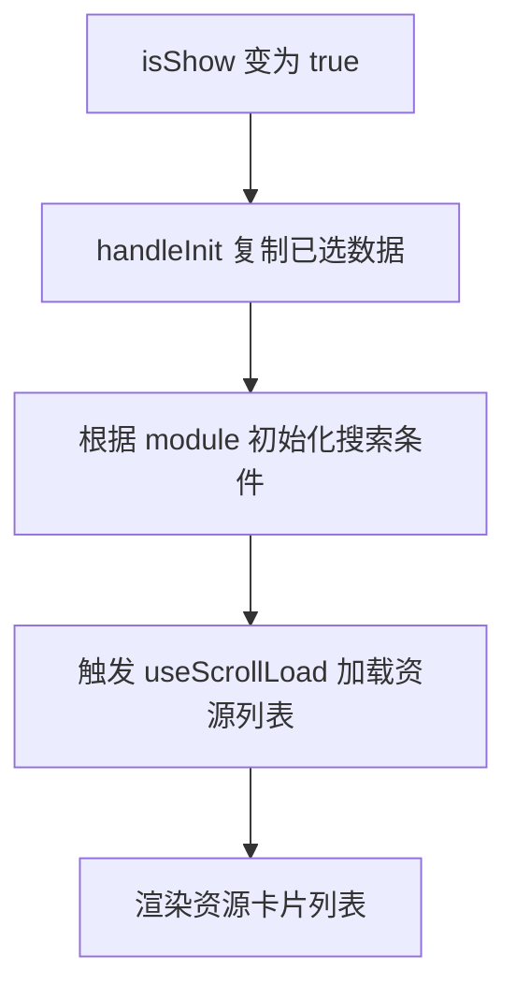
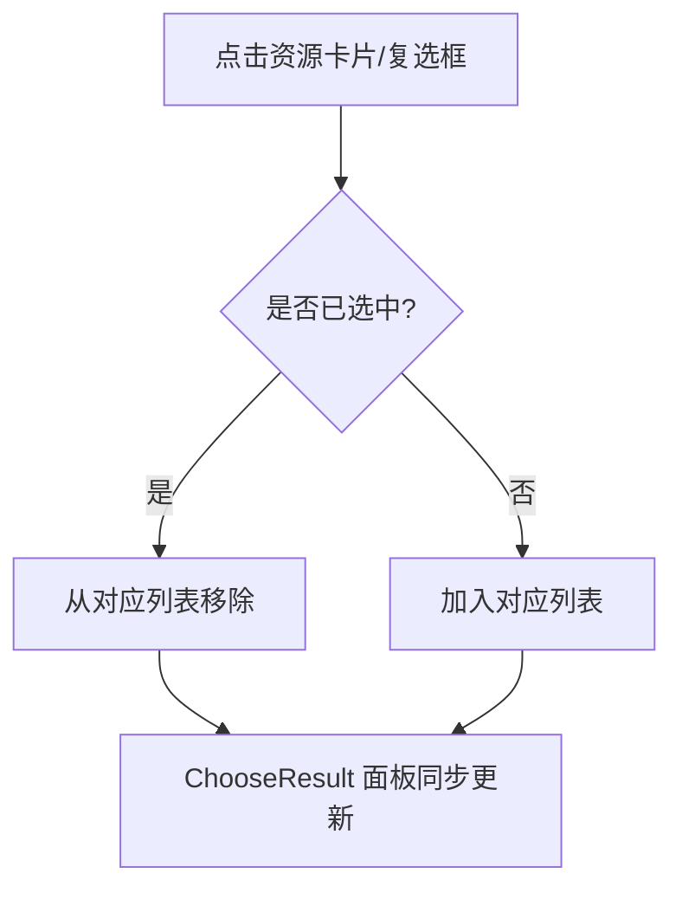
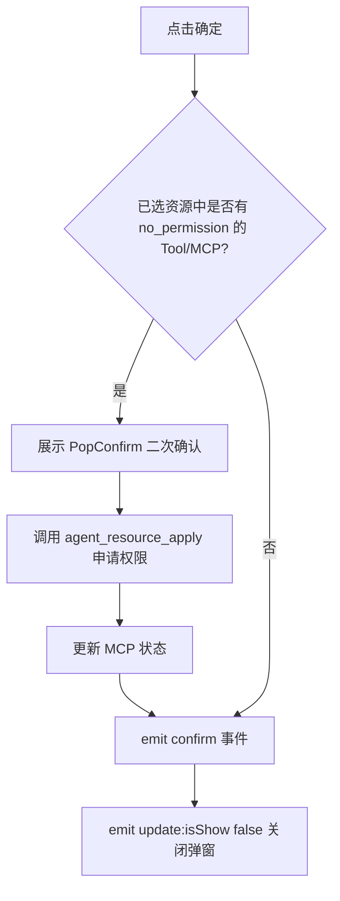
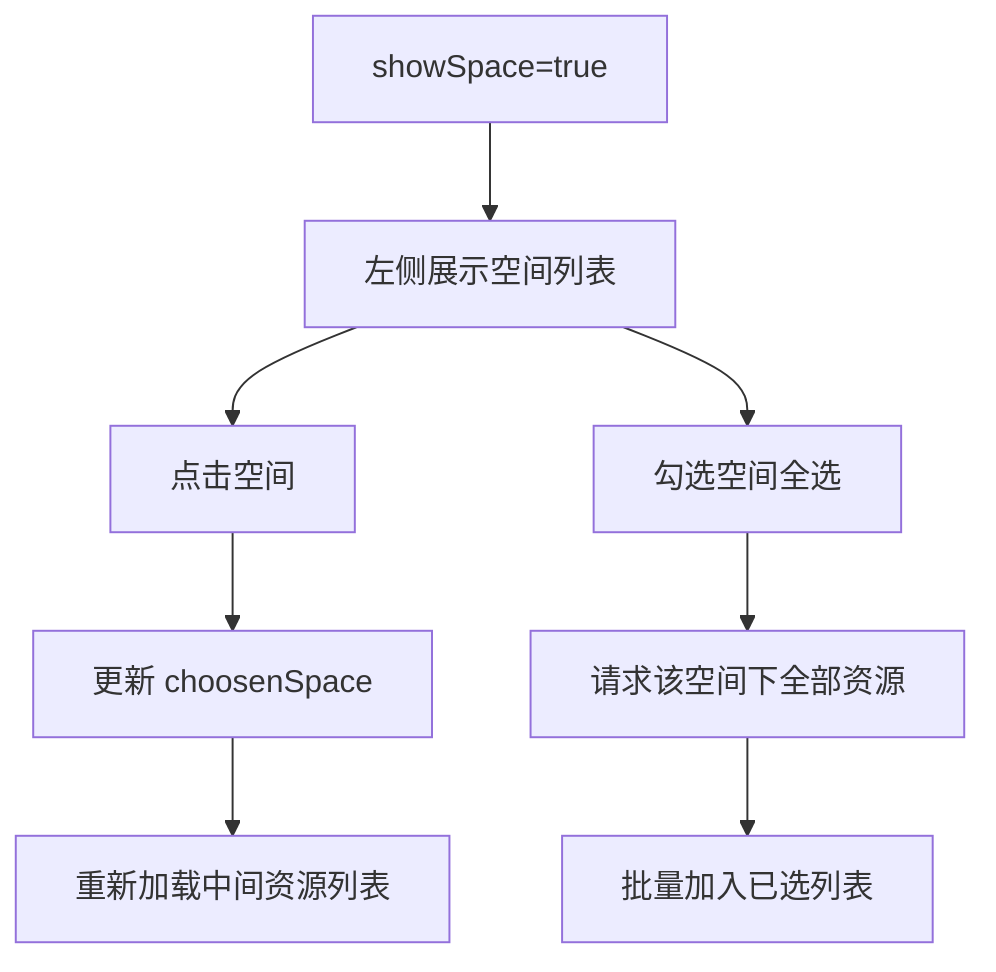

# @blueking/ai-ui-sdk 资源选择弹窗 RenderResourceDialog 使用说明

> 版本：`0.4.1-beta.19`
> 来源：`@blueking/ai-ui-sdk/components` 中的 `RenderResourceDialog`
> 配套文件：[analysis-config-sideslider.tsx](./analysis-config-sideslider.tsx)
> 适用范围：当前项目 `analysis-config-sideslider` 仅使用 **Skill、Knowledgebase、Agent** 三种资源选择，本文档已按该范围精简。

---

## 一、组件定位

`RenderResourceDialog` 是一个通用的**资源选择弹窗**，支持在弹窗内按模块浏览、搜索、勾选资源，并在右侧「选择结果」面板集中展示已选内容，最终通过 `confirm` 事件将选中的资源一次性回传给宿主。

当前项目未涉及 Tool、MCP、Knowledge、Collection、Prompt 等模块，以下内容仅围绕实际使用的三个模块整理。

---

## 二、引入方式

```ts
import { RenderResourceDialog } from '@blueking/ai-ui-sdk/components';
import { Module } from '@blueking/ai-ui-sdk/enums';
import type { ISdkNavigateAction, IKnowledgebase, IAgent, ISkill, ISpace } from '@blueking/ai-ui-sdk/types';
```

---

## 三、Props

### 3.1 必传属性

| 属性        | 类型       | 说明                                                                                 |
| ----------- | ---------- | ------------------------------------------------------------------------------------ |
| `isShow`    | `boolean`  | 是否展示弹窗                                                                         |
| `module`    | `Module`   | 当前资源模块；当前项目取值：`Module.Skill` / `Module.Knowledgebase` / `Module.Agent` |
| `spaceId`   | `string`   | 当前空间 ID                                                                          |
| `memberUrl` | `string`   | 成员搜索 URL                                                                         |
| `username`  | `string`   | 当前用户名，用于「我的/全部」筛选                                                    |
| `spaces`    | `ISpace[]` | 空间列表，用于显示空间名称                                                           |
| `apiPrefix` | `string`   | 接口前缀，所有内部 HTTP 请求都会拼接该前缀                                           |

### 3.2 按模块传入的已选资源

| 属性             | 类型               | 使用场景                          |
| ---------------- | ------------------ | --------------------------------- |
| `skills`         | `ISkill[]`         | `module === Module.Skill`         |
| `knowledgebases` | `IKnowledgebase[]` | `module === Module.Knowledgebase` |
| `agents`         | `IAgent[]`         | `module === Module.Agent`         |

### 3.3 可选属性

| 属性               | 类型        | 使用场景 / 说明                                          |
| ------------------ | ----------- | -------------------------------------------------------- |
| `title`            | `string`    | 弹窗标题，默认空                                         |
| `agentId`          | `number`    | 选择 Agent 时用于排除自身                                |
| `agentType`        | `AgentType` | 关联智能体类型（`single` / `flow`），用于 Agent 列表过滤 |
| `multiple`         | `boolean`   | 是否支持多选；当前项目 Agent/Knowledgebase/Skill 均多选  |
| `showTagSearch`    | `boolean`   | 是否展示标签搜索                                         |
| `showSpace`        | `boolean`   | 是否展示左侧空间筛选栏                                   |
| `showGenerateType` | `boolean`   | 是否展示生成类型标签                                     |
| `defaultIcon`      | `string`    | 默认图标                                                 |
| `canApply`         | `boolean`   | 是否「可申请资源」模式；当前项目通常为 `false`           |

### 3.4 当前项目不会使用的属性

以下属性仅在 Tool / MCP / Collection / Prompt / Knowledge 模块中生效，当前项目可忽略：

- `tools`、`mcps`、`knowledges`、`roles`、`prompts`
- `agentCode`
- `defaultModelId`、`roleTypes`

---

## 四、Events

| 事件            | 参数                                        | 触发时机                                                                |
| --------------- | ------------------------------------------- | ----------------------------------------------------------------------- |
| `update:isShow` | `(isShow: boolean)`                         | 关闭弹窗时                                                              |
| `confirm`       | `({ knowledgebases, agents, skills, ... })` | 点击「确定」提交时；当前项目主要取 `agents`、`knowledgebases`、`skills` |
| `navigate`      | `(value: ISdkNavigateAction)`               | 点击「去添加」「去申请」等需要外部路由跳转时                            |

---

## 五、支持的资源模块 `Module`

| 取值                   | 含义   | 弹窗内展示的卡片          |
| ---------------------- | ------ | ------------------------- |
| `Module.Agent`         | 智能体 | `RenderAgentCard`         |
| `Module.Knowledgebase` | 知识库 | `RenderKnowledgebaseCard` |
| `Module.Skill`         | Skill  | `RenderSkillCard`         |

---

## 六、接口路径约定

组件内部所有请求都基于同一个 `apiPrefix` 拼接。最终 URL 格式统一为：

```text
{apiPrefix}/{module}/{version}/{resource}/
```

例如 `apiPrefix = ''` 时，Agent 列表接口为 `/agent/v1/agent/`；若 `apiPrefix = '/api/ai'`，则为 `/api/ai/agent/v1/agent/`。

### 6.1 当前项目涉及的列表/计数接口

| 模块          | 列表接口                                           | 计数接口                                            | 说明                |
| ------------- | -------------------------------------------------- | --------------------------------------------------- | ------------------- |
| Agent         | `{apiPrefix}/agent/v1/agent/`                      | `{apiPrefix}/agent/v1/agent/count/`                 | 排除自身 + 仅已发布 |
| Knowledgebase | `{apiPrefix}/knowledgebase/v1/knowledgebase/list/` | `{apiPrefix}/knowledgebase/v1/knowledgebase/count/` | —                   |
| Skill         | `{apiPrefix}/skill/v1/skill/`                      | `{apiPrefix}/skill/v1/skill/count/`                 | —                   |

### 6.2 其他相关接口

| 触发条件     | 完整路径模板                                                 | 方法 |
| ------------ | ------------------------------------------------------------ | ---- |
| 资源申请     | `{apiPrefix}/agent/v1/agent/{agentId}/agent_resource_apply/` | POST |
| 获取成员列表 | `{memberUrl}`                                                | GET  |

所有请求都会自动带上请求头：`x-space-id: {spaceId}`。

---

## 七、内部结构

弹窗由以下子组件组合而成：

| 子组件           | 职责                                              |
| ---------------- | ------------------------------------------------- |
| `ChooseSpace`    | 左侧空间列表 + 我的/全部筛选 + 空间全选           |
| `ChooseResource` | 中间资源搜索 + 资源卡片列表（滚动加载）           |
| `ChooseResult`   | 右侧已选结果 + 按空间分组 + 删除/清空             |
| `ChooseFooter`   | 底部「去添加/去申请」+ 确定/取消 + 无权限二次确认 |

---

## 八、核心交互逻辑

### 8.1 打开弹窗

- `isShow` 由 `false` 变为 `true` 时，内部调用 `handleInit()`。
- 将传入的 `agents` / `knowledgebases` / `skills` 复制到内部响应式状态。
- 同时根据 `module` 初始化对应的搜索条件并触发首次数据加载。

### 8.2 资源选择

- 资源卡片以 `ResourceCardType.Choose` 模式渲染，显示复选框。
- 点击卡片或复选框切换选中状态：
  - 已选中 → 从对应列表移除。
  - 未选中 → 加入对应列表。
- Agent、Knowledgebase、Skill 均为多选。

### 8.3 空间筛选

- 当 `showSpace=true` 时，弹窗左侧展示空间列表。
- 切换空间会重新加载中间资源列表。
- 在空间条目上可勾选「全选该空间下资源」（`全部` 空间不支持全选）。
- 空间列表默认展示「本空间」标签。

### 8.4 我的/全部筛选

- `canApply=false` 时，空间栏顶部展示「我的 / 全部」胶囊切换。
- 「我的」只展示 `createdBy === username` 的资源。
- 「全部」展示所有有权限资源。

### 8.5 确认提交

1. 点击「确定」后，先检查已选资源中是否存在 `status === no_permission` 的 Tool/MCP。
2. 若存在无权限资源：
   - 弹出二次确认 PopConfirm，提示将自动创建申请单。
   - 确认后调用 `agent_resource_apply` 接口申请权限。
   - 接口返回后更新 MCP 状态，再抛出 `confirm` 事件。
3. 若无权限资源：直接抛出 `confirm` 事件并关闭弹窗。

> 当前项目常用场景为 Agent / Knowledgebase / Skill，不存在 Tool/MCP 的无权限二次确认逻辑。若需要确保不触发，可在传入前自行过滤掉无权限资源。

### 8.6 Skill 环境变量兜底

- 提交时如果 Skill 自身没有 `envs`，会自动把 `bkaiDependencies.envs` 中未填写的 `required` 项用 `default` 值补齐。

---

## 九、当前项目使用示例

以下示例以 Agent 模块为主；Knowledgebase / Skill 模块只需替换 `module` 和对应已选列表即可。

### 9.1 选择 Agent

```tsx
import { RenderResourceDialog } from '@blueking/ai-ui-sdk/components';
import { Module } from '@blueking/ai-ui-sdk/enums';
import type { ISdkNavigateAction, IAgent } from '@blueking/ai-ui-sdk/types';
import { defineComponent, ref } from 'vue';

export default defineComponent({
  setup() {
    const isShow = ref(false);
    const choosenAgents = ref<IAgent[]>([]);

    const handleConfirm = (data: { agents: IAgent[] }) => {
      choosenAgents.value = data.agents;
      isShow.value = false;
    };

    const handleNavigate = (route: ISdkNavigateAction) => {
      // 处理 SDK 导航动作，例如跳转到资源列表或空间资源管理
    };

    return () => (
      <RenderResourceDialog
        v-model:isShow={isShow.value}
        title='选择智能体'
        module={Module.Agent}
        apiPrefix=''
        spaceId='current-space-id'
        memberUrl='/member'
        username='admin'
        spaces={[{ spaceId: 'current-space-id', spaceName: '当前空间' }]}
        agents={choosenAgents.value}
        multiple={true}
        showSpace={true}
        showGenerateType={true}
        onConfirm={handleConfirm}
        onNavigate={handleNavigate}
      />
    );
  },
});
```

### 9.2 选择 Knowledgebase / Skill

将 `module` 替换为 `Module.Knowledgebase` 或 `Module.Skill`，并传入对应已选列表即可：

```tsx
const choosenKnowledgebases = ref<IKnowledgebase[]>([]);
const choosenSkills = ref<ISkill[]>([]);

// Knowledgebase
<RenderResourceDialog
  ...
  module={Module.Knowledgebase}
  knowledgebases={choosenKnowledgebases.value}
  onConfirm={(data: { knowledgebases: IKnowledgebase[] }) => { ... }}
/>

// Skill
<RenderResourceDialog
  ...
  module={Module.Skill}
  skills={choosenSkills.value}
  onConfirm={(data: { skills: ISkill[] }) => { ... }}
/>
```

---

## 十、插槽

| 插槽名       | 参数 | 说明                                                                     |
| ------------ | ---- | ------------------------------------------------------------------------ |
| `pre-action` | —    | 资源卡片底部操作区前置内容，透传给各 `Render*Card` 的 `pre-actions` 插槽 |

---

## 十一、注意事项

1. `apiPrefix` 必须传，即使为空字符串；组件内部所有 HTTP hook 都依赖它拼接 URL。
2. `module` 决定弹窗内可选择的资源类型，切换 `module` 需要重新打开弹窗才能生效。
3. 当前项目只使用 `Module.Skill`、`Module.Knowledgebase`、`Module.Agent`，其余模块相关属性可忽略。
4. `showSpace=true` 时弹窗会使用 `bk-resize-layout` 展示左侧空间栏，宽度默认 `33%`，可拖拽调整。
5. 所有内部请求都会自动带上 `x-space-id` 请求头，不需要宿主手动传。
6. 点击「去添加」「去申请」会触发 `navigate` 事件，宿主页面需要监听并做路由跳转。
7. 弹窗关闭时通过 `update:isShow` 同步状态，建议使用 `v-model:isShow` 绑定。
8. `defaultModelId` 和 `roleTypes` 仅在选择 Collection（角色）时需要；当前项目不涉及该模块，可忽略。

---

## 十二、流程图

### 12.1 弹窗打开与初始化



### 12.2 资源选择流程



### 12.3 确认提交流程



### 12.4 空间筛选流程



---

## 十三、相关类型速查

```ts
// 来自 @blueking/ai-ui-sdk/enums
enum Module {
  Knowledgebase = 'knowledgebase',
  Knowledge = 'knowledge',
  Prompt = 'prompt',
  Tool = 'tool',
  Collection = 'collection',
  Agent = 'agent',
  Mcp = 'mcp',
  Skill = 'skill',
}

enum AgentType {
  Single = 'single',
  Flow = 'flow',
}

// 来自 @blueking/ai-ui-sdk/types
interface ISpace {
  spaceId: string;
  spaceName: string;
}

interface ISdkNavigateAction {
  type: SdkNavigateActionType;
  // ... 根据 type 不同有额外字段
}
```
